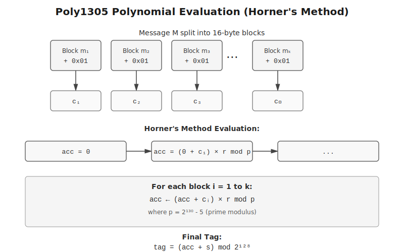
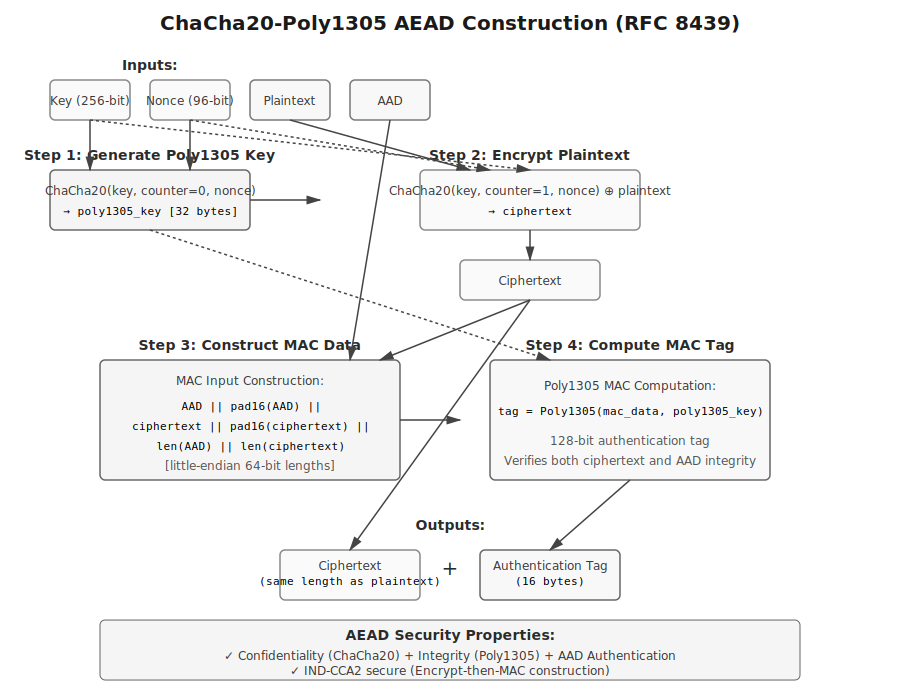

## 概述

ChaCha20-Poly1305 是一种 AEAD（Authenticated Encryption with Associated Data）算法，由 Daniel J. Bernstein 设计的 ChaCha20 流密码和 Poly1305 消息认证码组成。该算法已被纳入 TLS 1.3（RFC 8446）、WireGuard、OpenSSH 等协议标准。

与 AES-GCM 相比，ChaCha20-Poly1305 在无硬件加速的平台上具有更好的软件实现性能。本文分析其数学基础、构造方式和安全性质。

## ChaCha20 流密码

### 算法结构

ChaCha20 基于 Salsa20 设计，使用 ARX（Addition-Rotation-XOR）操作构造伪随机密钥流。内部状态为 4×4 矩阵，每个元素为 32 位字：

```
cccccccc  cccccccc  cccccccc  cccccccc
kkkkkkkk  kkkkkkkk  kkkkkkkk  kkkkkkkk
kkkkkkkk  kkkkkkkk  kkkkkkkk  kkkkkkkk
bbbbbbbb  nnnnnnnn  nnnnnnnn  nnnnnnnn
```

初始状态：
- 第 0-3 个字：常量 "expand 32-byte k" 的 ASCII 编码
- 第 4-11 个字：256 位密钥
- 第 12 个字：32 位块计数器
- 第 13-15 个字：96 位 nonce

$$
\text{State} = \begin{bmatrix}
0x61707865 & 0x3320646e & 0x79622d32 & 0x6b206574 \\
k_0 & k_1 & k_2 & k_3 \\
k_4 & k_5 & k_6 & k_7 \\
\text{counter} & n_0 & n_1 & n_2
\end{bmatrix}
$$

### Quarter Round 函数

核心运算单元，对 4 个字进行混合：

$$
\begin{aligned}
a &\leftarrow a + b; \quad d \leftarrow (d \oplus a) \lll 16 \\
c &\leftarrow c + d; \quad b \leftarrow (b \oplus c) \lll 12 \\
a &\leftarrow a + b; \quad d \leftarrow (d \oplus a) \lll 8 \\
c &\leftarrow c + d; \quad b \leftarrow (b \oplus c) \lll 7
\end{aligned}
$$

其中 $\lll$ 表示循环左移。

### 轮函数

一个双轮包含列轮和对角轮，共 8 次 Quarter Round：

**列轮**：
```
QR(0, 4,  8, 12)
QR(1, 5,  9, 13)
QR(2, 6, 10, 14)
QR(3, 7, 11, 15)
```

**对角轮**：
```
QR(0, 5, 10, 15)
QR(1, 6, 11, 12)
QR(2, 7,  8, 13)
QR(3, 4,  9, 14)
```

### 块函数

执行 10 个双轮（20 轮）后，将结果与初始状态相加：

```python
def chacha20_block(key, counter, nonce):
    state = initial_state(key, counter, nonce)
    working_state = state.copy()
    
    for i in range(10):
        column_round(working_state)
        diagonal_round(working_state)
    
    for i in range(16):
        working_state[i] += state[i]
    
    return working_state
```


加密操作通过与密钥流异或实现：

$$
C_i = P_i \oplus \text{ChaCha20}(K, \text{counter}, N)[i \bmod 64]
$$

## Poly1305 消息认证码

### 数学基础

Poly1305 是基于多项式求值的一次性 MAC，运算在模 $p = 2^{130} - 5$ 的有限域上进行。

### 密钥结构

256 位密钥分为两部分：
- $r$（128 位）：多项式系数，需要进行位清理
- $s$（128 位）：最终掩码

位清理操作：
```
r &= 0x0ffffffc0ffffffc0ffffffc0fffffff
```

该操作确保乘法运算不会在 64 位系统上溢出，同时保持算法安全性。

### 标签计算

消息 $M$ 分割为 16 字节块 $m_1, m_2, \ldots, m_k$。每个块添加填充标记：

$$
c_i = \begin{cases}
m_i || 0x01 & \text{if } |m_i| = 16 \\
m_i || 0x01 || 0x00^{16-|m_i|-1} & \text{if } |m_i| < 16
\end{cases}
$$

多项式求值：

$$
\text{tag} = \left(\sum_{i=1}^{k} c_i \cdot r^{k-i+1} \bmod p\right) + s
$$

使用 Horner 方法计算：

```python
def poly1305(msg, key):
    r = clamp(key[:16])
    s = key[16:32]
    accumulator = 0
    p = (1 << 130) - 5
    
    for i in range(0, len(msg), 16):
        block = msg[i:i+16]
        n = int.from_bytes(block + b'\x01', 'little')
        accumulator = ((accumulator + n) * r) % p
    
    tag = (accumulator + int.from_bytes(s, 'little')) % (2**128)
    return tag.to_bytes(16, 'little')
```



### 安全性

对于不同的消息 $M \neq M'$，碰撞概率为：

$$
\Pr[\text{tag}(M) = \text{tag}(M')] \leq \frac{d}{p}
$$

其中 $d$ 为多项式度数。对于 $2^{64}$ 字节消息，碰撞概率 $< 2^{-66}$。

## ChaCha20-Poly1305 AEAD 构造

### RFC 8439 标准

标准构造过程：

1. **生成 Poly1305 密钥**：
   ```
   poly1305_key = ChaCha20(K, 0, nonce)[0:32]
   ```

2. **加密明文**：
   ```
   ciphertext = ChaCha20(K, 1, nonce) ⊕ plaintext
   ```

3. **构造 MAC 输入**：
   ```
   mac_data = AAD || pad16(AAD) ||
              ciphertext || pad16(ciphertext) ||
              len(AAD) || len(ciphertext)
   ```

4. **计算标签**：
   ```
   tag = Poly1305(mac_data, poly1305_key)
   ```



### 实现

```python
def chacha20_poly1305_encrypt(key, nonce, plaintext, aad):
    poly_key_block = chacha20_block(key, 0, nonce)
    poly_key = serialize(poly_key_block)[:32]
    
    ciphertext = chacha20_encrypt(key, 1, nonce, plaintext)
    
    mac_data = (
        aad + pad16(aad) +
        ciphertext + pad16(ciphertext) +
        len(aad).to_bytes(8, 'little') +
        len(ciphertext).to_bytes(8, 'little')
    )
    
    tag = poly1305(mac_data, poly_key)
    return ciphertext, tag

def chacha20_poly1305_decrypt(key, nonce, ciphertext, tag, aad):
    poly_key_block = chacha20_block(key, 0, nonce)
    poly_key = serialize(poly_key_block)[:32]
    
    mac_data = (
        aad + pad16(aad) +
        ciphertext + pad16(ciphertext) +
        len(aad).to_bytes(8, 'little') +
        len(ciphertext).to_bytes(8, 'little')
    )
    
    expected_tag = poly1305(mac_data, poly_key)
    if not constant_time_compare(tag, expected_tag):
        raise AuthenticationError("MAC verification failed")
    
    plaintext = chacha20_encrypt(key, 1, nonce, ciphertext)
    return plaintext
```

## 性能特性

### 软件实现

ChaCha20-Poly1305 在无硬件加速环境下性能优于 AES-GCM：

| 算法 | x86-64 (cpb) | ARM Cortex-A53 (cpb) |
|------|--------------|----------------------|
| ChaCha20-Poly1305 | 3.5 | 4.2 |
| AES-128-GCM (AES-NI) | 0.7 | 0.9 |
| AES-128-GCM (软件) | 26.8 | 45.3 |

> cpb = cycles per byte

在有 AES-NI 支持的平台上，AES-GCM 具有性能优势；在无硬件加速的平台（移动设备、IoT 设备），ChaCha20-Poly1305 性能约为软件 AES-GCM 的 6-10 倍。

### 算法复杂度

**ChaCha20**：
- 时间复杂度：$O(n)$
- 每个 64 字节块需要 80 次 Quarter Round
- 每次 Quarter Round 包含 8 次基本运算

**Poly1305**：
- 时间复杂度：$O(n)$
- 每个 16 字节块需要 1 次模乘法和 1 次模加法

## 安全性分析

### ChaCha20 安全性

1. **密钥空间**：256 位密钥和 96 位 nonce 提供 $2^{256}$ 密钥空间。

2. **差分攻击**：20 轮提供充分安全边界，当前无实用差分攻击。

3. **Nonce 重用**：若 $(key, nonce)$ 重用，可通过密文异或恢复明文异或：
   $$
   C_1 \oplus C_2 = (P_1 \oplus S) \oplus (P_2 \oplus S) = P_1 \oplus P_2
   $$

### Poly1305 安全性

1. **一次性密钥**：每条消息需要不同的 $r$。ChaCha20-Poly1305 通过为每个 nonce 派生新密钥满足此要求。

2. **伪造概率**：
   $$
   \epsilon \leq \frac{8 \lceil L / 16 \rceil}{2^{106}}
   $$
   对于 $2^{64}$ 字节消息，伪造概率 $< 2^{-42}$。

3. **时序攻击**：标签验证必须使用常量时间比较：
   ```python
   def constant_time_compare(a, b):
       if len(a) != len(b):
           return False
       result = 0
       for x, y in zip(a, b):
           result |= x ^ y
       return result == 0
   ```

### AEAD 安全性

采用 Encrypt-then-MAC 构造。根据 Bellare-Namprempre（2000）定理：

> 若加密方案为 IND-CPA 安全，且 MAC 为 SUF-CMA 安全，则 Encrypt-then-MAC 构造为 IND-CCA2 和 INT-CTXT 安全。

ChaCha20-Poly1305 满足上述条件。

## 应用

### TLS 1.3

TLS 1.3 将 ChaCha20-Poly1305 列为强制实现的密码套件：

```
TLS_CHACHA20_POLY1305_SHA256
```

### WireGuard

WireGuard 使用 ChaCha20-Poly1305 作为对称加密算法：

```
Packet := ChaCha20Poly1305(
    key=DH_shared_secret,
    nonce=packet_counter,
    plaintext=IP_packet,
    aad=packet_header
)
```

### OpenSSH

OpenSSH 7.3+ 支持该算法：

```bash
ssh -c chacha20-poly1305@openssh.com user@host
```

### Linux 内核

内核从 4.2 版本开始支持：

```c
struct aead_request *req;
struct crypto_aead *tfm;

tfm = crypto_alloc_aead("rfc7539(chacha20,poly1305)", 0, 0);
crypto_aead_setkey(tfm, key, 32);
```

## 实现注意事项

### Nonce 管理

禁止在同一密钥下重用 nonce：

```python
# 错误示例
nonce = b'\x00' * 12

# 正确示例：使用计数器
nonce = counter.to_bytes(12, 'little')
counter += 1

# 正确示例：使用随机数（需足够熵源）
nonce = os.urandom(12)
```

### 密钥派生

不应直接使用用户密码，应使用 KDF：

```python
from cryptography.hazmat.primitives.kdf.pbkdf2 import PBKDF2HMAC
from cryptography.hazmat.primitives import hashes

kdf = PBKDF2HMAC(
    algorithm=hashes.SHA256(),
    length=32,
    salt=salt,
    iterations=600000,
)
key = kdf.derive(password)
```

### 时序攻击防护

MAC 验证必须使用常量时间比较：

```python
# 错误
if computed_tag == received_tag:
    ...

# 正确
if hmac.compare_digest(computed_tag, received_tag):
    ...
```

### 关联数据

AAD 通常包含协议头部信息：

```python
# TLS 1.3 AEAD 记录
aad = (
    record_type +           # 1 byte
    protocol_version +      # 2 bytes
    length                  # 2 bytes
)

ciphertext, tag = chacha20_poly1305_encrypt(
    key, nonce, plaintext, aad
)
```

### 大文件处理

分块处理并维护计数器：

```python
def encrypt_file(key, nonce_base, input_file, output_file):
    chunk_size = 64 * 1024
    counter = 0
    
    with open(input_file, 'rb') as fin, open(output_file, 'wb') as fout:
        while True:
            chunk = fin.read(chunk_size)
            if not chunk:
                break
            
            nonce = (int.from_bytes(nonce_base, 'little') + counter).to_bytes(12, 'little')
            ct, tag = chacha20_poly1305_encrypt(key, nonce, chunk, b'')
            
            fout.write(len(ct).to_bytes(4, 'little'))
            fout.write(tag)
            fout.write(ct)
            
            counter += 1
```

## 与其他 AEAD 方案对比

### vs. AES-GCM

| 特性 | ChaCha20-Poly1305 | AES-GCM |
|------|-------------------|---------|
| 软件性能 | 高 | 低 |
| 硬件性能（AES-NI） | 中 | 高 |
| 侧信道抗性 | 高（无查表） | 中（S-box 查表） |
| 实现复杂度 | 中 | 中 |
| 标准化 | RFC 8439 | NIST SP 800-38D |

### vs. AES-CCM

| 特性 | ChaCha20-Poly1305 | AES-CCM |
|------|-------------------|---------|
| 并行化 | 完全并行 | 串行 CBC-MAC |
| 性能 | 高 | 中 |
| 标签长度 | 128 位固定 | 可变（32-128 位）|
| 应用 | TLS 1.3, WireGuard | Thread, ZigBee |

### XChaCha20-Poly1305

XChaCha20 扩展 nonce 至 192 位，允许随机生成而不必担心碰撞。通过 HChaCha20 函数实现：

```python
def xchacha20_poly1305_encrypt(key, nonce_192, plaintext, aad):
    subkey = hchacha20(key, nonce_192[:16])
    return chacha20_poly1305_encrypt(subkey, nonce_192[16:], plaintext, aad)
```

## 形式化验证

### Coq 证明

已验证：
- ChaCha20 比特扩散性质
- Poly1305 碰撞概率界
- Encrypt-then-MAC IND-CCA2 安全性

### CryptoVerif

自动证明了在以下假设下的安全性：
1. ChaCha20 为 PRF
2. Poly1305 为 UF-CMA 安全

证明结论：
$$
\text{Adv}^{\text{AEAD}}_{\text{ChaCha20-Poly1305}}(A) \leq \text{Adv}^{\text{PRF}}_{\text{ChaCha20}}(B_1) + \text{Adv}^{\text{UF-CMA}}_{\text{Poly1305}}(B_2)
$$

### F* 实现

HACL* 项目提供 F* 实现，可提取为：
- C 代码（高性能）
- WebAssembly（浏览器）
- OCaml（验证）

## 后量子密码学

ChaCha20-Poly1305 不抗量子攻击，但可与后量子密钥交换算法结合：

```
量子安全密钥交换（CRYSTALS-Kyber）
    ↓
派生对称密钥
    ↓
ChaCha20-Poly1305 加密
```

NIST 后量子标准化项目推荐在混合模式中使用该算法。

## 参考文献

1. Bernstein, D. J. (2008). "ChaCha, a variant of Salsa20". *Workshop Record of SASC*.

2. Bernstein, D. J. (2005). "The Poly1305-AES message-authentication code". *FSE 2005*, Springer.

3. Nir, Y., & Langley, A. (2018). "ChaCha20 and Poly1305 for IETF Protocols". *RFC 8439*.

4. Procter, G. (2014). "A Security Analysis of the Composition of ChaCha20 and Poly1305". *IACR ePrint*.

5. Bellare, M., & Namprempre, C. (2000). "Authenticated encryption: Relations among notions and analysis of the generic composition paradigm". *ASIACRYPT 2000*, Springer.

6. Zinzindohoué, J. K., et al. (2017). "HACL*: A Verified Modern Cryptographic Library". *CCS 2017*.

---

*代码示例仅供教学使用，生产环境应使用经审计的密码学库。*
