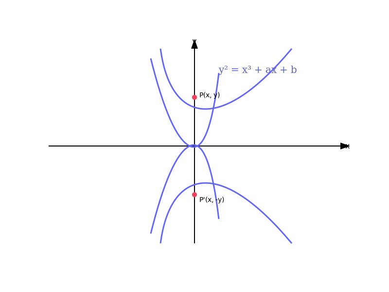
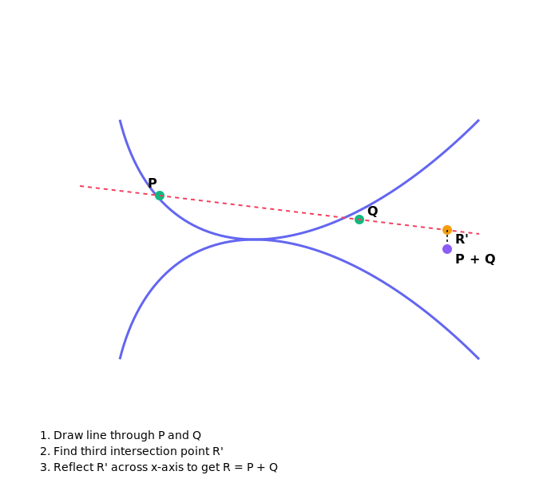
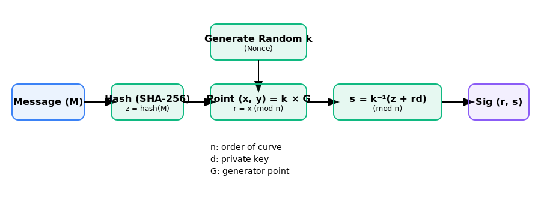

# ECDSA Algorithm Analysis

Elliptic Curve Digital Signature Algorithm (ECDSA) is a fundamental cryptographic primitive used to ensure authenticity and integrity in digital communications. Since its adoption as an ANSI standard in 1999 and FIPS standard in 2000, it has become the cornerstone of modern security protocols.

Today, ECDSA is ubiquitous. It secures TLS 1.3 connections, provides the foundation for Bitcoin and Ethereum wallet addresses, and protects SSH access to millions of servers worldwide. Compared to RSA, ECDSA offers equivalent security with significantly smaller key sizes. For instance, a 256 bit ECDSA key provides the same security level as a 3072 bit RSA key.

## 1. Elliptic Curve Basics

At the heart of ECDSA is the mathematics of elliptic curves over finite fields. For cryptographic purposes, we typically use the Short Weierstrass form equation:

$$y^2 = x^3 + ax + b$$

To ensure the curve is smooth and has no singular points (which would make it cryptographically weak), the discriminant $\Delta$ must be non-zero:

$$\Delta = -16(4a^3 + 27b^2) \neq 0$$

An elliptic curve is symmetric about the x-axis. If a point $(x, y)$ is on the curve, then $(x, -y)$ is also on the curve.



In cryptography, we don't work with real numbers. Instead, we work over a finite field $\mathbb{F}_p$, where $p$ is a large prime. This means all coordinates and calculations are performed modulo $p$.

## 2. Point Addition and Scalar Multiplication

The set of points on an elliptic curve, along with a special "point at infinity" $\mathcal{O}$, forms an Abelian group under a specific addition operation.

### Geometric Interpretation

To add two distinct points $P$ and $Q$:
1. Draw a straight line through $P$ and $Q$.
2. This line intersects the curve at exactly one more point, $R'$.
3. Reflect $R'$ across the x-axis to get $R = P + Q$.



### Mathematical Formulas

For two points $P(x_1, y_1)$ and $Q(x_2, y_2)$ where $P \neq Q$:

The slope $\lambda$ is:
$$\lambda = \frac{y_2 - y_1}{x_2 - x_1} \pmod p$$

The resulting point $R(x_R, y_R)$ is:
$$x_R = \lambda^2 - x_1 - x_2 \pmod p$$
$$y_R = \lambda(x_1 - x_R) - y_1 \pmod p$$

If $P = Q$ (Point Doubling), the slope $\lambda$ is derived from the derivative of the curve equation:
$$\lambda = \frac{3x_1^2 + a}{2y_1} \pmod p$$

### Scalar Multiplication

The operation $Q = k \times P$ (adding point $P$ to itself $k$ times) is known as scalar multiplication. While this is easy to compute using the "double and add" algorithm, the reverse operation is extremely difficult.

## 3. The ECDLP Problem

The security of ECDSA relies on the Elliptic Curve Discrete Logarithm Problem (ECDLP). Given points $P$ and $Q = k \times P$, it's computationally infeasible to find the scalar $k$ if the field size is large enough. Unlike integer factorization used in RSA, there's no known sub-exponential algorithm for solving ECDLP on well-chosen curves.

## 4. ECDSA Algorithm Steps

### Domain Parameters

Before signing, both parties must agree on the domain parameters $(p, a, b, G, n, h)$:
- $p$: The prime defining the finite field.
- $a, b$: Curve coefficients.
- $G$: A base point (generator) on the curve.
- $n$: The order of $G$ (the smallest $n$ such that $n \times G = \mathcal{O}$).
- $h$: The cofactor (usually 1).

### Key Generation

1. Select a private key $d_A$ as a random integer in the range $[1, n-1]$.
2. Compute the public key $Q_A = d_A \times G$.

### Digital Signature Generation

To sign a message $M$:
1. Calculate $e = \text{Hash}(M)$.
2. Let $z$ be the $L_n$ leftmost bits of $e$, where $L_n$ is the bit length of the group order $n$.
3. Select a cryptographically strong random integer $k$ from $[1, n-1]$.
4. Calculate the curve point $(x_1, y_1) = k \times G$.
5. Calculate $r = x_1 \pmod n$. If $r = 0$, go back to step 3.
6. Calculate $s = k^{-1}(z + r d_A) \pmod n$. If $s = 0$, go back to step 3.

The signature is the pair $(r, s)$.



### Verification

To verify the signature $(r, s)$ for public key $Q_A$ and message $M$:
1. Verify that $r$ and $s$ are integers in $[1, n-1]$.
2. Calculate $e = \text{Hash}(M)$ and the corresponding $z$.
3. Calculate $w = s^{-1} \pmod n$.
4. Calculate $u_1 = zw \pmod n$ and $u_2 = rw \pmod n$.
5. Calculate the curve point $(x_1, y_1) = u_1 \times G + u_2 \times Q_A$.
6. The signature is valid if $r \equiv x_1 \pmod n$.

### Proof of Correctness

The verification works because:
$$C = u_1 \times G + u_2 \times Q_A = (zw) \times G + (rw) \times (d_A \times G)$$
$$C = (z + rd_A)w \times G = (z + rd_A)s^{-1} \times G$$
Since $s = k^{-1}(z + rd_A) \pmod n$, then $s^{-1} \equiv k(z + rd_A)^{-1} \pmod n$.
Substituting $s^{-1}$:
$$C = (z + rd_A)k(z + rd_A)^{-1} \times G = k \times G$$
Thus the x-coordinate of $C$ matches $r$.

## 5. Implementation in Pseudocode

```python
def sign(message, private_key, G, n):
    z = hash_to_int(message)
    while True:
        k = secure_random(1, n-1)
        point_R = scalar_mult(k, G)
        r = point_R.x % n
        if r == 0: continue
        
        k_inv = mod_inverse(k, n)
        s = (k_inv * (z + r * private_key)) % n
        if s == 0: continue
        
        return (r, s)

def verify(message, signature, public_key, G, n):
    r, s = signature
    if not (1 <= r < n and 1 <= s < n):
        return False
        
    z = hash_to_int(message)
    w = mod_inverse(s, n)
    u1 = (z * w) % n
    u2 = (r * w) % n
    
    point_C = add_points(scalar_mult(u1, G), scalar_mult(u2, public_key))
    return r == (point_C.x % n)
```

## 6. Security Considerations

### The Importance of the Nonce $k$

The most critical security requirement in ECDSA is that $k$ (the nonce) must be unique, random, and secret. If the same $k$ is used to sign two different messages with the same private key, the private key can be recovered:

$$s_1 = k^{-1}(z_1 + rd_A)$$
$$s_2 = k^{-1}(z_2 + rd_A)$$
$$s_1 - s_2 = k^{-1}(z_1 - z_2)$$
$$k = (z_1 - z_2)(s_1 - s_2)^{-1}$$

Once $k$ is found, $d_A = r^{-1}(sk - z) \pmod n$. This vulnerability famously led to the hacking of the PlayStation 3 and has caused numerous Bitcoin thefts. To prevent this, RFC 6979 specifies a method to derive $k$ deterministically from the message and the private key.

### Side-Channel Attacks

Implementations must be careful to avoid timing attacks, especially during scalar multiplication. Algorithms like "double and add" can leak information about the private key through power consumption or execution time. Constant-time implementations are essential for production systems.

## 7. Common Curves Comparison

Different applications use different curves based on security requirements and performance needs.

| Curve | Bit Length | Security Level | Features | Used In |
|-------|------------|----------------|----------|---------|
| **secp256k1** | 256 | 128 bit | Koblitz curve, efficient endomorphism | Bitcoin, Ethereum |
| **P-256 (secp256r1)** | 256 | 128 bit | NIST standard, Verifiable random coefficients | TLS, SSH, JWT |
| **Curve25519** | 255 | 128 bit | Montgomery curve, EdDSA, extremely fast | Signal, WireGuard, SSH |
| **P-384** | 384 | 192 bit | Higher security level | Government/Enterprise |

## 8. Conclusion

ECDSA represents a sophisticated balance of algebraic geometry and number theory. It provides the high-performance digital signatures required for our modern interconnected world. As we move towards the era of post-quantum cryptography, while ECDSA is vulnerable to Shor's algorithm, it remains the industry standard for securing current digital infrastructure.

Understanding the mechanics of ECDSA is not just an academic exercise; it's essential for any developer or security professional working with blockchain, web security, or identity management.
