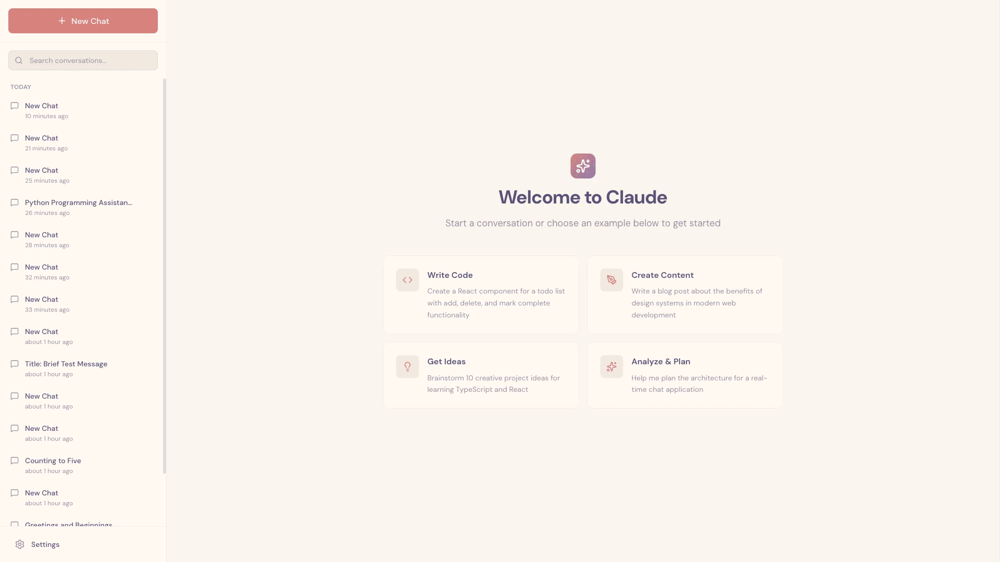

原文链接：[Effective harnesses for long-running agents](https://www.anthropic.com/engineering/effective-harnesses-for-long-running-agents)。

随着 AI agents 能力不断提升，开发者也越来越希望它们去承担那些持续数小时、甚至数天的复杂任务。不过，如何让 agents 在多个上下文窗口之间持续而稳定地推进工作，仍然是一个没有彻底解决的问题。

长时间运行 agent 的核心难点在于：它必须在离散 session 里工作，而每个新 session 开始时，都不记得之前发生过什么。可以把它想成一个软件项目由轮班工程师接手，每一班的新工程师上来时，对上一班做过什么完全没有记忆。由于上下文窗口是有限的，而大多数复杂项目又不可能在单个窗口里完成，因此 agents 需要一种跨 coding session 衔接状态的方式。

我们为 [Claude Agent SDK](https://platform.claude.com/docs/en/agent-sdk/overview) 设计了一套两部分方案，让它能在多个上下文窗口之间更有效地工作：一部分是 **initializer agent**，负责在第一次运行时把环境搭起来；另一部分是 **coding agent**，负责在之后的每个 session 中持续做增量推进，同时给下一个 session 留下清晰的 artifacts。配套的代码示例可以在这份 [quickstart](https://github.com/anthropics/claude-quickstarts/tree/main/autonomous-coding) 里看到。

## 长时间运行 agent 的问题

Claude Agent SDK 是一个相当强的通用 agent harness，既适合编码，也适合那些需要模型借助工具去收集上下文、规划和执行的任务。它具备诸如 compaction 这样的上下文管理能力，让 agent 不至于在任务进行中把上下文窗口彻底耗尽。理论上，如果只看这套机制，似乎 agent 应该可以无限期地持续做有用工作。

但 compaction 并不够。开箱即用时，即便是像 Opus 4.5 这种前沿 coding model，只给它一个高层 prompt，再让它在 Claude Agent SDK 上跨多个上下文窗口循环运行，它依然很难真正做出一个生产级 Web 应用。比如你只告诉它“build a clone of [claude.ai](http://claude.ai/redirect/website.v1.b0aa7437-73ef-4e93-986f-45906bac114f)”时，问题就会暴露出来。

Claude 的失败主要表现为两类模式。第一类是它倾向于一次想做太多事情，几乎是在试图 one-shot 整个应用。很多时候，这会导致模型在实现做到一半时就把上下文耗尽，结果下一个 session 一上来面对的是一个 feature 半做完、还没有任何记录的工作区。新的 session 只能去猜之前发生了什么，再花大量时间把基础应用重新救回到可运行状态。即便有 compaction，也还是会出现这种情况，因为 compaction 并不总能把足够清楚的指令传给下一个 agent。

第二类失败模式通常出现在项目后期。当前面已经做出了一些 feature 之后，后来的某个 agent instance 会环顾四周，觉得“看起来已经有进展了”，然后直接宣布任务完成。

把这件事拆开来看，问题实际上有两部分。第一，我们需要在一开始就搭出一个初始环境，为 prompt 所要求的全部 features 打好基础，这样 agent 才更容易按步骤、按 feature 往前推进。第二，我们还需要让每个 agent 不只是朝着目标做增量推进，还要在 session 结束时把环境留在一个干净状态。这里所谓“干净状态”，指的是那种可以直接合并到主分支的代码：没有明显 bug，代码整齐、文档充分，一个开发者拿到它后，可以直接继续做新 feature，而不必先花时间收拾别处留下的烂摊子。

我们在内部实验中，是用下面这套两段式方案来处理这些问题的：

1. Initializer agent：第一个 agent session 使用专门的 prompt，请模型先把初始环境搭起来，包括一个 `init.sh` 脚本、一个记录 agents 做过什么的 `claude-progress.txt` 文件，以及一个展示新增文件的初始 git commit。
2. Coding agent：后续每个 session 都要求模型做一点增量推进，然后留下结构化更新。

这里的关键洞见在于，如何让 agent 在每次带着全新上下文窗口开始时，仍然能快速理解当前工作状态。我们最后的做法，是把 `claude-progress.txt` 文件和 git history 一起用起来。这些做法的灵感，其实来自我们对高效软件工程师日常工作方式的观察。

## 环境管理

在更新后的 [Claude 4 prompting guide](https://docs.claude.com/en/docs/build-with-claude/prompt-engineering/claude-4-best-practices#multi-context-window-workflows) 里，我们分享过一些关于多上下文窗口工作流的经验，其中有一种 harness 结构会在“第一个上下文窗口里使用不同的 prompt”。这个“不同的 prompt”会要求 initializer agent 先把环境搭好，把未来 coding agents 要高效工作所需的上下文都提前准备进去。这里我们会更具体地展开这种环境里几个关键组成部分。

### Feature list

为了避免 agent 试图一次性把整个 app 做完，或者过早把项目判断为完成，我们要求 initializer agent 根据用户最初的 prompt，扩写出一份完整的 feature requirements 文件。在 [claude.ai](http://claude.ai/redirect/website.v1.b0aa7437-73ef-4e93-986f-45906bac114f) clone 这个例子里，这意味着文件里会列出超过 200 个 feature，比如“用户可以打开一个新 chat，输入 query，按下回车，并看到 AI response”。这些 feature 一开始都会被标记成 failing，这样后面的 coding agents 就会有一个关于“完整功能长什么样”的清晰轮廓。

```json
{
  "category": "functional",
  "description": "New chat button creates a fresh conversation",
  "steps": [
    "Navigate to main interface",
    "Click the 'New Chat' button",
    "Verify a new conversation is created",
    "Check that chat area shows welcome state",
    "Verify conversation appears in sidebar"
  ],
  "passes": false
}
```

我们要求 coding agents 编辑这个文件时，只能去修改 `passes` 字段的状态，同时还会用比较强硬的提示语，比如“删除或修改这些测试是不可接受的，因为这会导致功能缺失或潜在 bug 被掩盖”。试验了一段时间后，我们最后选择用 JSON，而不是 Markdown，因为相比 Markdown，模型更不容易随意改动或覆盖 JSON 文件。

### 增量推进

在有了这套初始环境脚手架之后，后续 coding agent 的下一步，就被要求一次只处理一个 feature。这种增量方式，最后被证明是抑制 agent 一次做太多事情倾向的关键。

不过，即便是按增量方式工作，模型在做完代码修改之后，仍然必须把环境留在一个干净状态。我们实验中发现，最有效的诱导方式，是要求模型把自己的进展提交到 git，并使用明确的 commit message，同时在 progress file 里写一段进展总结。这样一来，模型就可以借助 git 去回滚错误修改，也可以恢复到之前已经验证过的可工作状态。

这些做法也提升了效率，因为它们让 agent 不必再花时间去猜之前发生过什么，更不用反复把基础应用重新救活。

### 测试

我们观察到的最后一个主要失败模式，是 Claude 很容易在没有正确测试的情况下就把某个 feature 标记成完成。默认情况下，Claude 会改代码，也会做一些像单元测试或对开发服务器发 `curl` 这样的验证，但它经常意识不到：这个 feature 并没有真正端到端地工作起来。

在构建 Web app 的场景里，一旦明确要求 Claude 使用浏览器自动化工具、并像人类用户一样去做测试，它在端到端验证上的表现就会明显变好。



给 Claude 提供这类测试工具，对性能提升很明显，因为 agent 能借此发现并修复那些光看代码不容易意识到的问题。

当然，问题还没有完全解决。比如 Claude 自身的视觉能力有限，浏览器自动化工具也不可能覆盖所有类型的 bug。举个例子，Claude 通过 Puppeteer MCP 看不到浏览器原生 alert modal，所以依赖这类 modal 的功能往往会更容易出 bug。

## 快速进入状态

在前面这些东西都到位之后，每个 coding agent 在开始工作时都会被要求先走一遍固定步骤。这些步骤有些看起来很基础，但确实有帮助：

1. 先运行 `pwd`，确认你当前在什么目录工作。你只能编辑这个目录里的文件。
2. 读取 git logs 和 progress files，快速了解最近都做了什么。
3. 读取 features list file，选择当前还没完成、且优先级最高的 feature 去处理。

这种做法还能帮 Claude 在每个 session 里省掉一些 tokens，因为它不必自己摸索“这个项目应该怎么测试”。同时，我们也会要求 initializer agent 预先写好一个 `init.sh` 脚本，用来启动开发服务器，并在实现新 feature 之前，先跑一轮基础的端到端检查。

在 `claude.ai` clone 这个例子里，这意味着 agent 每次开头都会先把本地开发服务器拉起来，再通过 Puppeteer MCP 新开一个 chat、发送一条消息、拿到响应。这样一来，如果应用被上一个 session 留在了一个坏状态，Claude 就能很快发现并先把旧 bug 修掉。如果它反而直接开始做新 feature，问题往往只会被进一步放大。

因此，一个典型 session 的开头大致会像这样：

```text
[Assistant] I'll start by getting my bearings and understanding the current state of the project.
[Tool Use] <bash - pwd>
[Tool Use] <read - claude-progress.txt>
[Tool Use] <read - feature_list.json>
[Assistant] Let me check the git log to see recent work.
[Tool Use] <bash - git log --oneline -20>
[Assistant] Now let me check if there's an init.sh script to restart the servers.
<Starts the development server>
[Assistant] Excellent! Now let me navigate to the application and verify that some fundamental features are still working.
<Tests basic functionality>
[Assistant] Based on my verification testing, I can see that the fundamental functionality is working well. The core chat features, theme switching, conversation loading, and error handling are all functioning correctly. Now let me review the tests.json file more comprehensively to understand what needs to be implemented next.
<Starts work on a new feature>
```

| **Problem** | **Initializer Agent Behavior** | **Coding Agent Behavior** |
| --- | --- | --- |
| Claude declares victory on the entire project too early. | Set up a feature list file: based on the input spec, set up a structured JSON file with a list of end-to-end feature descriptions. | Read the feature list file at the beginning of a session. Choose a single feature to start working on. |
| Claude leaves the environment in a state with bugs or undocumented progress. | An initial git repo and progress notes file is written. | Start the session by reading the progress notes file and git commit logs, and run a basic test on the development server to catch any undocumented bugs. End the session by writing a git commit and progress update. |
| Claude marks features as done prematurely. | Set up a feature list file. | Self-verify all features. Only mark features as “passing” after careful testing. |
| Claude has to spend time figuring out how to run the app. | Write an `init.sh` script that can run the development server. | Start the session by reading `init.sh`. |

## 后续工作

这项研究展示了一套可行方案：在 long-running agent harness 中，让模型在多个上下文窗口之间持续做增量推进。但仍然还有不少开放问题。

其中最明显的一点，是我们还不清楚：跨上下文工作时，到底是单个通用 coding agent 表现更好，还是多 agent 架构会更强。直觉上看，像 testing agent、quality assurance agent，或者专门做代码清理的 agent，在软件开发生命周期中的某些子任务上，可能会做得更好。

另外，这个 demo 主要是为全栈 Web app 开发做了优化。未来一个自然方向，是把这些经验推广到别的领域。很可能这里的一部分、甚至大部分经验，都能用到其他需要 long-running agentic tasks 的场景中，比如科学研究或金融建模。

## 致谢

本文由 Justin Young 撰写。特别感谢 David Hershey、Prithvi Rajasakeran、Jeremy Hadfield、Naia Bouscal、Michael Tingley、Jesse Mu、Jake Eaton、Marius Buleandara、Maggie Vo、Pedram Navid、Nadine Yasser 和 Alex Notov 对这项工作的贡献。

这项工作反映了 Anthropic 多个团队的共同努力，尤其是 code RL 和 Claude Code 团队。正是这些团队，让 Claude 能够更安全地进行长时间跨度的自主软件工程。如果你也想参与类似工作，欢迎前往 [anthropic.com/careers](http://anthropic.com/careers) 申请。

## 脚注

1. 这里把它们称为不同 agents，只是因为它们的初始 user prompts 不同。除此之外，system prompt、工具集合和整体 harness 本身其实都是一样的。
