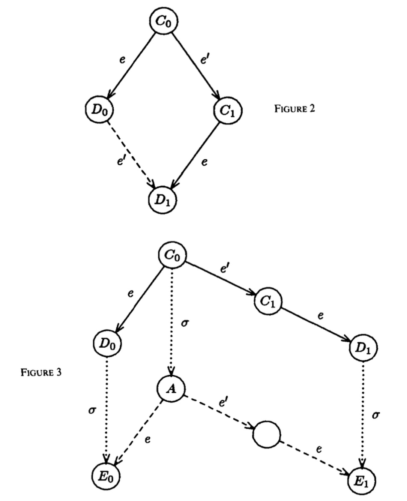

Original paper link: https://groups.csail.mit.edu/tds/papers/Lynch/jacm85.pdf

In distributed systems theory, FLP impossibility is one of the most representative results. It is not concerned with the engineering implementation details of any particular protocol, but with a more fundamental question: **under what kind of system model can consensus actually be solved completely?**

FLP is formed from the initials of the three authors Fischer, Lynch, and Paterson. In their classic paper, "Impossibility of Distributed Consensus with One Faulty Process," they proved that in a fully asynchronous distributed system, even if only a single process is allowed to fail by crashing, there exists no deterministic consensus algorithm that both satisfies safety and guarantees termination.

The importance of this result does not lie in denying real-world consensus protocols, but in clearly drawing the theoretical prerequisite under which distributed consensus can hold. Many protocols that were widely adopted later, such as Paxos, Raft, and various systems built around leader election, timeouts, and majority-based mechanisms, must in essence introduce additional assumptions in order to work around the limit revealed by FLP.

---

## I. What Is the Consensus Problem?

The consensus problem can be stated as follows: in a distributed system composed of multiple processes, each process initially holds an input value, and the protocol must ensure that these processes eventually decide on one common value.

Typically, a consensus algorithm must satisfy the following three basic properties:

### 1. Termination
All non-faulty processes must eventually make a decision.

### 2. Agreement
All non-faulty processes that make a decision must produce the same result.

### 3. Validity
The value that is finally decided must come from the initial proposal of some process, rather than being fabricated by the system out of thin air.

Taken together, these three properties constitute the consensus problem in the classical sense. Using transaction commit as an example, multiple data managers must make a consistent decision on whether to "commit" or "roll back," which is in fact a concrete manifestation of the consensus problem.

---

## II. What FLP Focuses On

The model discussed by FLP is far simpler than problems involving Byzantine faults, message tampering, malicious nodes, and similar concerns.

It assumes:

- the system is fully asynchronous;
- message transmission has no fixed upper bound;
- process execution speed has no fixed upper bound;
- there is no global clock in the system;
- a process cannot reliably determine whether another process has already crashed or is merely running slowly;
- the message system itself is reliable, meaning messages are not lost, tampered with, or duplicated out of thin air.

Therefore, FLP is primarily concerned with the lack of deterministic timing information in asynchronous systems. As long as a process has not responded for a long time, other processes cannot accurately distinguish among the following possibilities:

- the other side has already crashed;
- the other side is still alive but executing extremely slowly;
- the network is experiencing very large delays;
- the message is still in transit.

Yet a consensus protocol must advance its decision based on the states of other nodes in the system. Once this judgment itself is no longer reliable, the termination property of the protocol encounters a fundamental difficulty.

Compared with asynchronous systems, synchronous systems have known upper bounds on both process execution time and message transmission delay. In that case, if a node still has not responded within the prescribed time, other nodes may treat it as faulty based on that time bound. In other words, **timeouts in synchronous systems carry clear informational meaning**.

However, this premise does not hold in asynchronous systems. Since no time bound exists, "no reply has been received" no longer constitutes valid evidence by itself. The system cannot determine whether a node has failed merely from waiting time, and this is exactly the fundamental reason why the FLP result holds.

Therefore, FLP is not saying that "the consensus problem itself cannot be solved." Rather, it says: **if the system provides no additional information about time or failure detection, then the termination of consensus cannot be guaranteed unconditionally.**

---

## III. The Core Conclusion of FLP

The core conclusion proved by FLP can be summarized as follows:

> In a fully asynchronous distributed system, even if at most one process crashes, there exists no deterministic consensus protocol that remains correct and also eventually terminates in every admissible execution.

One point here deserves special attention: the "impossibility" mainly targets **termination**, rather than safety.

From an engineering point of view, many protocols can in practice ensure agreement to a large extent, meaning they do not produce the severe error where two nodes decide on different results. What is truly difficult to guarantee absolutely is that all non-faulty processes will certainly complete a decision within finite time.

This is also why FLP is often understood in distributed systems as:  
**in consensus under asynchronous systems, safety can be designed to be strong, while liveness cannot be obtained unconditionally.**

---

## IV. The Basic Proof Idea

In this proof, the notion of a **bivalent configuration** is a crucial concept. Starting from some system state:

- if no matter how the execution proceeds afterward the system can only end up deciding 0, then the state is 0-valent;
- if it can only end up deciding 1, then the state is 1-valent;
- if starting from that state the future may still lead to either 0 or 1, then it is a bivalent state.

The meaning of a bivalent state is that the system has not yet been uniquely driven toward a particular decision result, and future scheduling order can still affect the final outcome.

The FLP proof roughly consists of two key steps.

### Step One: Prove that a bivalent initial state must exist
That is, the system is not doomed from the very beginning to decide only a single result. There always exists some initial configuration from which multiple future outcomes remain possible.

### Step Two: Prove that bivalence can always be extended
This is the most critical part of the whole proof. FLP shows that as long as the system is currently still in a bivalent state, there is always some legal event schedule through which the system can remain in the "bivalent" region rather than entering a univalent state where a real decision is completed.

Thus one can construct an infinite execution path:

- all non-faulty processes continuously receive opportunities to execute;
- messages can also continue to be processed;
- the system remains legally running throughout;
- yet the protocol still cannot finish making a decision.

This directly denies the requirement that "all non-faulty processes eventually decide," and thus denies the existence of a completely correct deterministic consensus protocol in this model.

The elegance of FLP lies in the fact that it proves not merely that "failure may occur in some cases," but that "there always exists some legal execution under which the protocol cannot terminate."

---

## V. FLP and Existing Consensus Mechanisms

If consensus is impossible in asynchronous systems, then why do Paxos, Raft, transaction commit protocols, and various distributed consistency components still exist in reality? The key is that these real-world protocols do not satisfy the strictest premises used in the FLP proof. More precisely, they usually work around the model targeted by FLP in the following ways:

### 1. Introducing partial synchrony assumptions
Real-world systems may temporarily experience network jitter, node congestion, and message delay, but they usually do not remain indefinitely in an extremely disordered state. Many protocols in practice rely on the assumption that the system will eventually recover to a sufficiently stable condition.

### 2. Introducing timeout mechanisms and failure detection
Timeouts cannot theoretically distinguish "slow" from "dead" with exact precision, but in engineering practice they provide the necessary basis for moving the system forward. They are not absolutely correct judgments, but acceptable approximations.

### 3. Relaxing the determinism requirement
Some protocols use randomization to avoid bad schedules and break deadlock probabilistically. In this way, although they cannot guarantee termination on every execution path, they can obtain the property of "terminating with probability 1."

Therefore, what FLP truly reveals is: **any consensus protocol that can work in reality must be built on additional conditions beyond the pure asynchronous model.**

Using Paxos as an example, on the surface Paxos can reach consensus in distributed environments, while FLP says consensus is impossible in asynchronous systems, which may seem contradictory. In fact, there is no contradiction. The reason is that Paxos never claims to provide unconditional liveness in the pure asynchronous model. What it truly guarantees is:

- **Safety**: it will not produce two conflicting decisions;
- **Liveness**: under the assumptions that the network eventually stabilizes, timeout settings are reasonable, and a leader can remain active for a sustained period, the protocol can usually make progress and complete the decision.

In other words, Paxos preserves the most important safety property, while placing termination on top of additional engineering conditions.

---

## VII. Summarizing the Engineering Lessons of FLP

Although FLP is a theoretical result, it
---

## VI. Conclusion

The value of FLP impossibility does not lie in denying real-world consensus protocols, but in showing that the ability of distributed systems to achieve consensus always has clear boundaries. As a theoretical result, it therefore offers highly practical guidance for engineering system design:

    1. Network delay affects not only performance, but also protocol liveness
    In consensus systems, the consequences of network congestion and long-tail latency are not merely lower throughput or slower response times.
    More importantly, they make it increasingly difficult for nodes to determine whether other nodes have actually failed or are simply responding slowly.
    As long as this uncertainty persists, the protocol's ability to make progress is affected.
    
    2. Insufficient node resources can also appear as "fault-like" behavior
    If a node is under CPU pressure, blocked on disk I/O, suffering heavy memory pressure, or paused for a long time,
    then from the viewpoint of other nodes its behavior looks very similar to an actual fault: it simply does not respond for a long time.
    Therefore, the stable operation of a consensus protocol depends not only on the algorithm itself, but also on whether underlying compute resources are sufficient.
    
    3. Timeout parameters are, in essence, engineering compromises
    In theory, an asynchronous system cannot accurately judge faults through time.
    But in engineering practice, if one completely rejects time-based judgments, the system becomes difficult to keep moving forward.
    Therefore, timeout mechanisms are fundamentally pragmatic designs: they do not guarantee absolute correctness, yet they provide the decision basis necessary for the system to continue operating.

In distributed environments, time is not merely a performance issue; it also determines whether the system can distinguish "a node has already failed" from "a node is merely responding slowly." Once this distinction cannot be made reliably, it becomes impossible under fully asynchronous conditions to obtain both absolute safety and guaranteed termination in a deterministic consensus protocol.

That is precisely why Paxos, Raft, transaction commit, and various leader-election and failure-detection mechanisms are all built on additional assumptions, such as partial synchrony, timeouts, or randomization.

What FLP truly reminds us is this: the hardest part in distributed systems is never merely getting nodes to reach agreement, but clearly understanding, in an environment full of uncertainty, what the system can guarantee and what it cannot.
