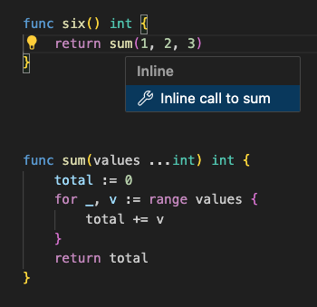
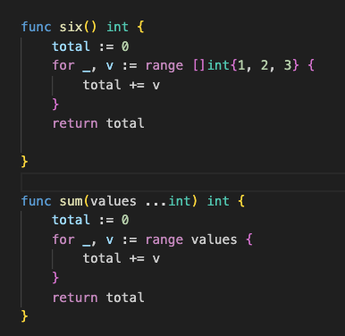

Original article: [//go:fix inline and the source-level inliner](https://go.dev/blog/inliner)

Go 1.26 contains an all-new implementation of the `go fix` subcommand, designed to help you keep your Go code up-to-date and modern. For an introduction, start by reading the [recent post](https://go.dev/blog/gofix) on the topic. In this post, we’ll look at one particular feature: the source-level inliner.

While `go fix` has several bespoke modernizers for specific new language and library features, the source-level inliner is the first fruit of the effort to provide [self-service](https://go.dev/blog/gofix#self-service) modernizers and analyzers. It enables package authors to express simple API migrations and updates in a straightforward and safe way. We’ll first explain what the source-level inliner is and how you can use it, then look at several aspects of the problem and the technology behind it.

## Source-level inlining

In 2023, the Go team built an [algorithm](https://pkg.go.dev/golang.org/x/tools/internal/refactor/inline) for source-level inlining of function calls in Go. To inline a call means to replace the call with a copy of the body of the called function, substituting arguments for parameters. It is called "source-level" inlining because it durably modifies the source code. By contrast, the inlining algorithm found in a typical compiler, including Go’s compiler, performs a similar transformation on the compiler’s ephemeral [intermediate representation](https://en.wikipedia.org/wiki/Intermediate_representation) to generate more efficient code.

If you have ever invoked gopls’s ["Inline call"](https://go.dev/gopls/features/transformation#refactorinlinecall-inline-call-to-function) interactive refactoring, you have already used the source-level inliner. The screenshots below show the effect of inlining the call to `sum` from the function named `six`.




The inliner is a crucial building block for a number of source transformation tools. For example, gopls uses it for the “Change signature” and “Remove unused parameter” refactorings because, as we’ll see below, it takes care of many subtle correctness issues that arise when refactoring function calls.

The same inliner is also one of the analyzers in the all-new `go fix` command. In `go fix`, it enables self-service API migration and upgrades using a new `//go:fix inline` directive comment. Let’s look at a few examples of how this works and what it can be used for.

### Example: renaming `ioutil.ReadFile`

In Go 1.16, the `ioutil.ReadFile` function, which reads the contents of a file, was deprecated in favor of the new `os.ReadFile` function. In effect, the function was renamed, though Go’s [compatibility promise](https://go.dev/doc/go1compat) prevents the old name from ever being removed.

```go
package ioutil

import "os"

// ReadFile reads the file named by filename…
// Deprecated: As of Go 1.16, this function simply calls [os.ReadFile].
func ReadFile(filename string) ([]byte, error) {
    return os.ReadFile(filename)
}
```

Ideally, every Go program in the world would stop using `ioutil.ReadFile` and call `os.ReadFile` instead. The inliner can help do exactly that. First, annotate the old function with `//go:fix inline`. This tells the tool that whenever it sees a call to this function, it should inline the call.

```go
package ioutil

import "os"

// ReadFile reads the file named by filename…
// Deprecated: As of Go 1.16, this function simply calls [os.ReadFile].
//go:fix inline
func ReadFile(filename string) ([]byte, error) {
    return os.ReadFile(filename)
}
```

When `go fix` is run on a file containing a call to `ioutil.ReadFile`, it applies the replacement:

```diff
$ go fix -diff ./...
-import "io/ioutil"
+import "os"

-   data, err := ioutil.ReadFile("hello.txt")
+   data, err := os.ReadFile("hello.txt")
```

The call has been inlined, effectively replacing one function call with another.

Because the inliner replaces a function call with a copy of the callee body, rather than with an arbitrary expression, the transformation should in principle not change program behavior, aside from code that explicitly inspects the call stack. This differs from tools like `gofmt -r`, which allow arbitrary rewrites: those are powerful, but they must be watched carefully.

For many years, similar source-level inliner tools have been used inside Google by teams working on Java, Kotlin, and C++. To date, those tools have eliminated millions of calls to deprecated functions in Google’s code base. Users simply add the directives and wait. Overnight, robots quietly prepare, test, and submit batches of code changes across a monorepo with billions of lines of code. If all goes well, by the next morning the old API is no longer in use and can be safely deleted. Go’s inliner is a relative newcomer, but it has already been used to prepare more than 18,000 changelists in Google’s monorepo.

### Example: fixing API design flaws

With a little creativity, a variety of migrations can be expressed as inlinings. Consider this hypothetical `oldmath` package:

```go
// Package oldmath is the bad old math package.
package oldmath

// Sub returns x - y.
func Sub(y, x int) int

// Inf returns positive infinity.
func Inf() float64

// Neg returns -x.
func Neg(x int) int
```

It has several design flaws: `Sub` declares its parameters in the wrong order, `Inf` implicitly chooses one of the two infinities, and `Neg` is redundant with `Sub`. Suppose there is a `newmath` package that avoids these mistakes and we want users to migrate to it. The first step is to implement the old API in terms of the new package and deprecate the old functions. Then we add inliner directives:

```go
// Package oldmath is the bad old math package.
package oldmath

import "newmath"

// Sub returns x - y.
// Deprecated: the parameter order is confusing.
//go:fix inline
func Sub(y, x int) int {
    return newmath.Sub(x, y)
}

// Inf returns positive infinity.
// Deprecated: there are two infinite values; be explicit.
//go:fix inline
func Inf() float64 {
    return newmath.Inf(+1)
}

// Neg returns -x.
// Deprecated: this function is unnecessary.
//go:fix inline
func Neg(x int) int {
    return newmath.Sub(0, x)
}
```

Now, when users of `oldmath` run `go fix`, the command replaces calls to the old functions with their new counterparts. gopls has included `inline` in its analyzer suite for some time, so if your editor uses gopls, the moment you add `//go:fix inline` directives you will start seeing a diagnostic at each call site, such as “call of `oldmath.Sub` should be inlined,” along with a suggested fix for that specific call.

For example, this old code:

```go
import "oldmath"

var nine = oldmath.Sub(1, 10) // diagnostic: "call to oldmath.Sub should be inlined"
```

will be transformed into:

```go
import "newmath"

var nine = newmath.Sub(10, 1)
```

Notice that after the fix, the arguments to `Sub` appear in the logical order. If you are lucky, the inliner will successfully remove every call to functions in `oldmath`, perhaps allowing you to delete it as a dependency.

The `inline` analyzer also works on types and constants. If `oldmath` had originally declared a rational-number type and a constant for π, the following forwarding declarations could migrate them to `newmath` while preserving the behavior of existing code:

```go
package oldmath

//go:fix inline
type Rational = newmath.Rational

//go:fix inline
const Pi = newmath.Pi
```

Each time the `inline` analyzer encounters a reference to `oldmath.Rational` or `oldmath.Pi`, it rewrites it to refer to `newmath` instead.

## Under the hood of the inliner

At a glance, source-level inlining seems straightforward: replace the call with the body of the callee, introduce variables for parameters, and bind call arguments to those variables. But correctly handling all the complexity and corner cases while still producing acceptable code is a serious technical challenge. The inliner itself is about 7,000 lines of dense, compiler-like logic. Here are six aspects that make the problem tricky.

### 1. Parameter elimination

One of the inliner’s most important tasks is to replace each occurrence of a callee parameter with the corresponding argument from the call when it is safe to do so. In the simplest case, the argument is a trivial literal such as `0` or `""`, so substitution is straightforward and the parameter can be eliminated.

**Before**

```go
//go:fix inline
func show(prefix, item string) {
    fmt.Println(prefix, item)
}
```

```go
show("", "hello")
```

**After**

```go
fmt.Println("", "hello")
```

For less trivial literals such as `404` or `"go.dev"`, substitution is still straightforward so long as the parameter appears at most once. But if the parameter appears multiple times, sprinkling copies of such values through the code would be poor style and would obscure the relationship among them. A later edit to only one occurrence could introduce inconsistency.

In such cases, the inliner must be more conservative. Whenever one or more parameters cannot be fully substituted for any reason, the inliner inserts an explicit parameter-binding declaration:

**Before**

```go
//go:fix inline
func printPair(before, x, y, after string) {
    fmt.Println(before, x, after)
    fmt.Println(before, y, after)
}
```

```go
printPair("[", "one", "two", "]")
```

**After**

```go
var before, after = "[", "]"
fmt.Println(before, "one", after)
fmt.Println(before, "two", after)
```

### 2. Side effects

In Go, as in all imperative programming languages, calling a function may update variables, and those updates may in turn affect the behavior of other functions. Consider the call to `add` below:

```go
func add(x, y int) int { return y + x }

z = add(f(), g())
```

A trivial inlining would substitute `x` with `f()` and `y` with `g()`, yielding:

```go
z = g() + f()
```

But this result is incorrect because evaluation of `g()` now happens before `f()`. If the two functions have side effects, those effects are now observed in a different order and may affect the result. It is poor style to write code that depends on effect ordering among call arguments, but tools still have to preserve the program’s semantics.

So the inliner must attempt to prove that `f()` and `g()` do not have side effects on each other. If that succeeds, it may use the simpler result. Otherwise, it must fall back to an explicit binding:

```go
var x = f()
z = g() + x
```

When considering side effects, not only the argument expressions matter. The order in which parameters are evaluated relative to other code in the callee also matters. Consider this call to `add2`:

```go
//go:fix inline
func add2(x, y int) int {
    return x + other() + y
}

add2(f(), g())
```

This time the parameters are used in declaration order, so the substitution `f() + other() + g()` does not change the order between `f()` and `g()`, but it does change the order between `other()` and `g()`. Furthermore, if the callee uses a parameter inside a loop, substitution may change the number of effects.

The inliner uses a novel [hazard analysis](https://cs.opensource.google/go/x/tools/+/refs/tags/v0.42.0:internal/refactor/inline/inline.go;l=1978;drc=e3a69ffcdbb984f50100e76ebca6ff53cf88de9c) to model effect ordering in each callee function. Even so, its ability to construct the required safety proofs is quite limited. For example, if `f()` and `g()` are simple accessors, calling them in either order would be perfectly safe. An optimizing compiler might know enough about their implementations to reorder them safely. But unlike a compiler, which generates object code for one instant in time, the inliner makes permanent changes to source code, so it cannot rely on ephemeral implementation details. As an extreme example, consider this function:

```go
func start() { /* TODO: implement */ }
```

An optimizing compiler may delete calls to `start()` because it has no effects today, but the inliner may not, because it might matter tomorrow.

In short, the inliner can sometimes produce results that are obviously too conservative to the eye of an experienced maintainer. In those cases, a little manual cleanup may still improve the fixed code stylistically.

### 3. “Fallible” constant expressions

You might imagine that replacing a parameter with a constant argument of the same type is always safe. Surprisingly, that is not true, because some checks that used to happen at run time may now happen—and fail—at compile time. Consider this call to `index`:

```go
//go:fix inline
func index(s string, i int) byte {
    return s[i]
}

index("", 0)
```

A naive inliner might replace `s` with `""` and `i` with `0`, producing `""[0]`. But that is not a legal Go expression, because this index is out of bounds for this string. Since `""[0]` is made entirely of constants, it is evaluated at compile time and the program will not build. By contrast, the original program would fail only if execution ever reaches that call, which presumably a working program does not.

Consequently, the inliner must keep track of expressions and operands that may become constant during parameter substitution and thereby trigger additional compile-time checks. It constructs a [constraint system](https://cs.opensource.google/go/x/tools/+/master:internal/refactor/inline/falcon.go;l=43;drc=1aca71e85510ecc45dddbc335b30b64298c2a31e) and tries to solve it. Each unsatisfied constraint is resolved by adding an explicit binding for the constrained parameters.

### 4. Shadowing

Typical argument expressions contain identifiers that refer to symbols in the caller’s file. The inliner must ensure that each such name would still refer to the same symbol after substitution. In other words, none of the caller’s names may be *shadowed* inside the callee. If that fails, the inliner must insert parameter bindings again, as in this example:

**Before**

```go
//go:fix inline
func f(val string) {
    x := 123
    fmt.Println(val, x)
}
```

```go
x := "hello"
f(x)
```

**After**

```go
x := "hello"
{
    var val string = x
    x := 123
    fmt.Println(val, x)
}
```

Conversely, the inliner must also check that each name in the *callee* body still refers to the same thing once spliced into the call site. In other words, none of the callee’s names may be shadowed or missing in the caller. When names are missing, the inliner may need to insert additional imports.

### 5. Unused variables

When an argument expression has no effects and its corresponding parameter is never used, the expression may be removed. However, if that expression contains the last reference to a local variable in the caller, the result may be a compile error because the variable is now unused.

**Before**

```go
//go:fix inline
func f(_ int) { print("hello") }
```

```go
x := 42
f(x)
```

**After**

```go
x := 42 // error: unused variable: x
print("hello")
```

So the inliner must account for references to local variables and avoid removing the final one. It is still possible that two different inliner fixes each remove the second-to-last reference to the same variable, so the two fixes are valid in isolation but not together. In that case, manual cleanup is unavoidable.

### 6. `defer`

In some cases, it is simply impossible to inline a call away completely. Consider a call to a function that contains a `defer` statement: if the call were eliminated, the deferred function would execute when the *caller* returns, which is too late. The only safe option is to wrap the callee body in an immediately invoked function literal. That function literal, `func() { … }()`, delimits the lifetime of the `defer` statement:

**Before**

```go
//go:fix inline
func callee() {
    defer f()
    …
}
```

```go
callee()
```

**After**

```go
func() {
    defer f()
    …
}()
```

If you invoke the inliner in gopls, you’ll see exactly this transformation. That result may be appropriate in an interactive setting, where you can immediately tweak the code or undo the fix, but it is rarely desirable in a batch tool. As a matter of policy, the `go fix` analyzer refuses to inline such “literalized” calls.

### An optimizing compiler for “tidiness”

We have now seen half a dozen examples of how the inliner handles tricky semantic corner cases correctly. By putting all that complexity into the inliner itself, users can simply apply the “Inline call” refactoring in their IDE or add a `//go:fix inline` directive to their own functions and be confident that the resulting code transformations can be applied with only minimal review.

Although Go has made good progress toward that goal, it has not fully reached it, and likely never will. Consider a compiler: a sound compiler produces correct output for any input and never miscompiles your program. An *optimizing* compiler then tries to produce faster code without sacrificing correctness. An inliner is similar, except its optimization target is not speed but *tidiness*: inlining a call must never change behavior, and ideally it produces code that is maximally neat and tidy. Unfortunately, an optimizing compiler is [provably](https://en.wikipedia.org/wiki/Rice%27s_theorem) never finished. Showing that two different programs are equivalent is undecidable, and there will always be transformations that a human expert knows are safe but the tool cannot prove. The same is true of the inliner: there will always be cases where its output is fussier than necessary or otherwise stylistically inferior to what a human expert would choose, and there will always be more “tidiness optimizations” left to add.

## Try it out!

We hope this tour of the inliner gives you a sense of both the challenges involved and the direction Go is taking in building sound, self-service code transformation tools. Try the inliner yourself, either interactively in your IDE or through `//go:fix inline` directives and the `go fix` command, and share your experience and ideas for further improvements or new tools.
