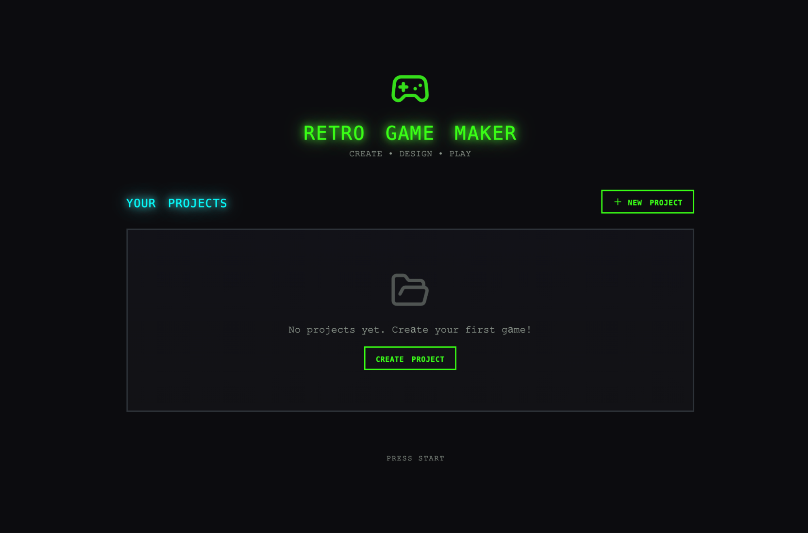
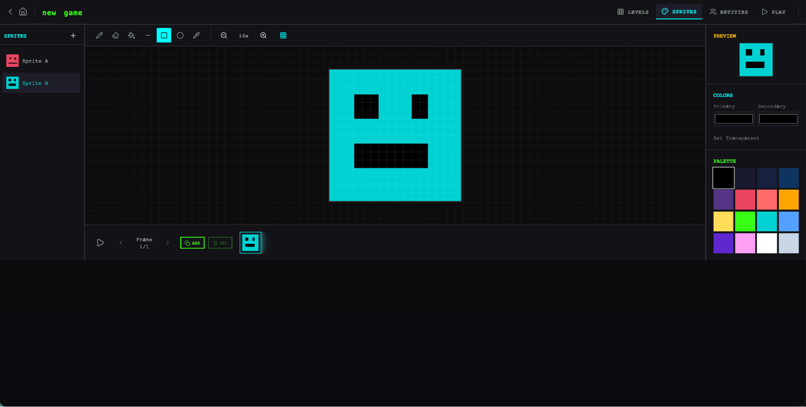
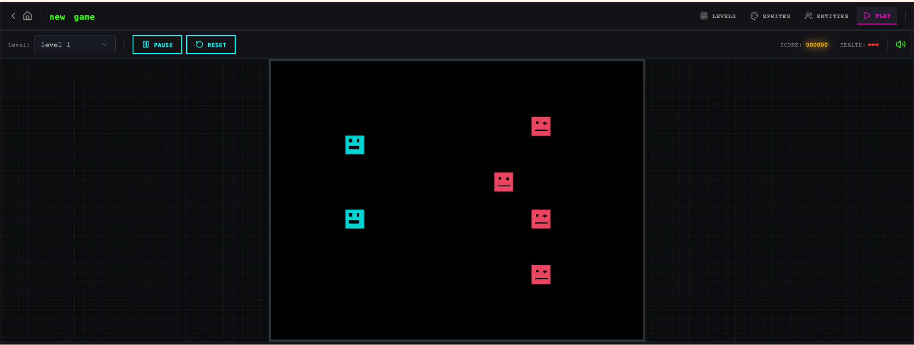
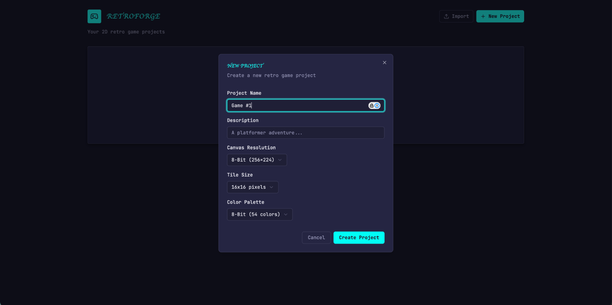
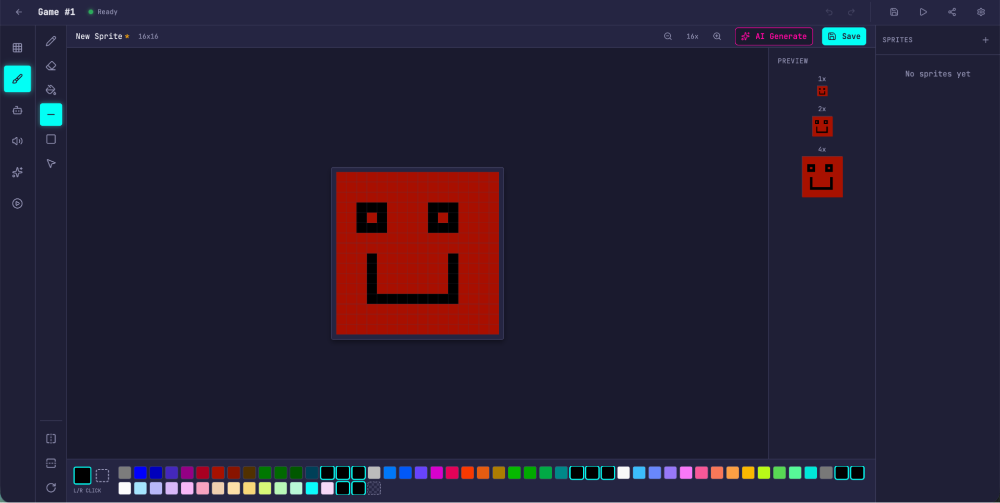
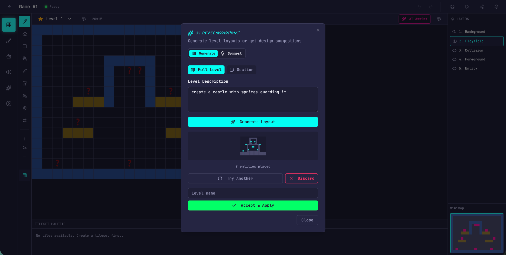
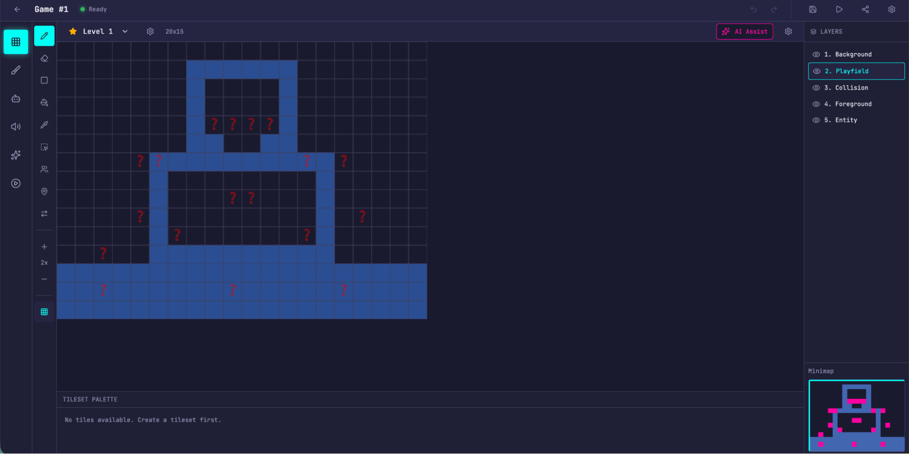
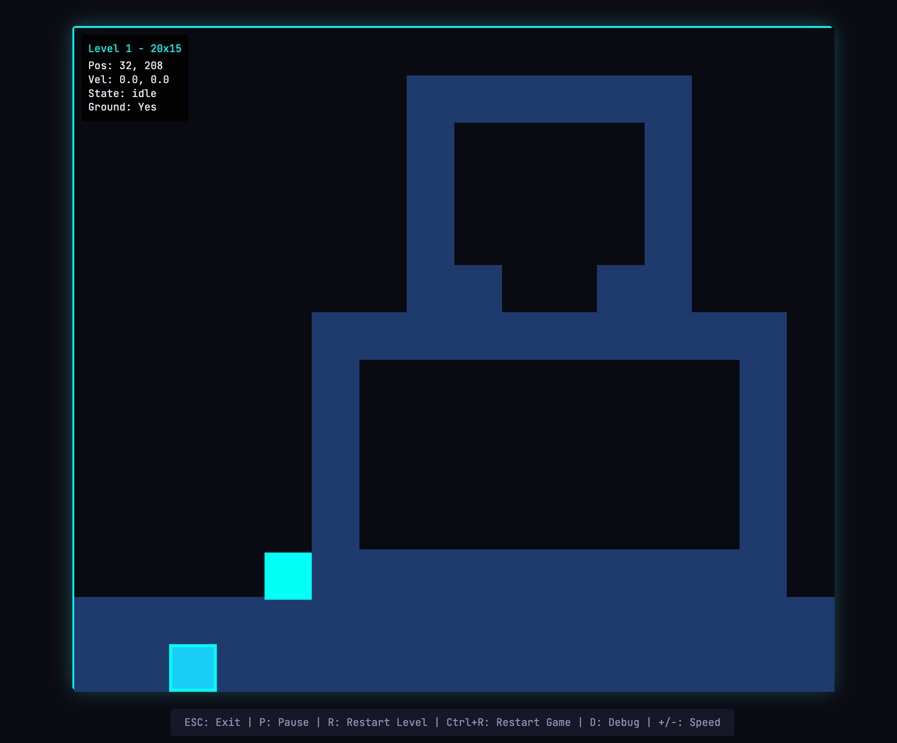

原文链接：[Harness design for long-running application development](https://www.anthropic.com/engineering/harness-design-long-running-apps)，作者 Prithvi Rajasekaran。

*本文作者 Prithvi Rajasekaran，来自 Anthropic 的 [Labs](https://www.anthropic.com/news/introducing-anthropic-labs) 团队。*

在过去几个月里，我一直在处理两个彼此相关的问题：一是让 Claude 产出更高质量的前端设计，二是让它在没有人工干预的情况下构建完整应用。这项工作源于我们之前在 [frontend design skill](https://github.com/anthropics/claude-code/blob/main/plugins/frontend-design/skills/frontend-design/SKILL.md) 和 [long-running coding agent harness](https://www.anthropic.com/engineering/effective-harnesses-for-long-running-agents) 上做过的尝试。当时我和同事们通过 prompt engineering 和 harness design，把 Claude 的表现提升到了远高于 baseline 的水平，但这两条路最后都碰到了上限。

为了继续往前做，我开始找一种能同时适用于两个差异很大的领域的 AI 工程方法：一个领域更多受主观审美支配，另一个领域则更依赖可验证的正确性和可用性。受 [生成对抗网络](https://en.wikipedia.org/wiki/Generative_adversarial_network)（GAN）启发，我设计了一种包含 generator agent 和 evaluator agent 的多智能体结构。要让 evaluator 稳定、而且带有“品味”地给输出打分，前提是先构造一组评价标准，把“这个设计好不好”这种主观判断转成可以具体评分的条目。

随后，我把这些方法应用到了长时间自主编码任务上，并继承了我们之前 harness 工作中的两个经验：把构建过程拆成更容易处理的小块，以及使用结构化产物在不同 session 之间交接上下文。最后的结果是一个由 planner、generator 和 evaluator 三个 agent 组成的架构，它可以在持续数小时的自主编码 session 中产出较完整的全栈应用。

## 为什么朴素实现会失效

我们之前已经展示过，harness design 对长时间 agentic coding 的效果有很大影响。在更早的一次 [实验](https://www.anthropic.com/engineering/effective-harnesses-for-long-running-agents) 里，我们用了一个 initializer agent 把产品 spec 分解成任务列表，再让一个 coding agent 按 feature 逐个实现，同时通过 artifacts 在 session 之间交接上下文。更广泛的开发者社区也逐渐收敛到类似经验，比如 [Ralph Wiggum](https://ghuntley.com/ralph/) 这种方法，就会用 hooks 或 scripts 让 agents 在连续迭代循环中工作。

但有些问题一直存在。任务一旦更复杂，agent 随着时间推移还是容易逐渐跑偏。在进一步拆解这个问题时，我们观察到了这类任务里常见的两个失败模式。

第一个问题是，模型在长任务中随着上下文窗口不断被填满，往往会逐渐失去连贯性（可以参考我们关于 [context engineering](https://www.anthropic.com/engineering/effective-context-engineering-for-ai-agents) 的文章）。有些模型还会出现“context anxiety”，也就是当它们觉得快碰到上下文上限时，会开始过早收尾。所谓 context reset，就是彻底清空上下文窗口，重新启动一个新的 agent，同时依靠结构化 handoff，把前一个 agent 的状态和接下来的步骤交给后一个 agent。这个做法能同时缓解上面两个问题。

这和 compaction 不一样。compaction 是在同一个 agent 内部，对更早的对话做原地总结，让它在压缩后的历史上继续工作。compaction 虽然保留了连续性，但不会给 agent 一个真正的“干净上下文”，所以 context anxiety 仍然可能存在。reset 则提供了一块真正的 clean slate，代价是 handoff artifact 必须带足够多的状态，好让下一个 agent 能平稳接手。我们之前测试时发现，Claude Sonnet 4.5 的 context anxiety 明显到只靠 compaction 还不够，因此 context reset 成了 harness 设计中的关键部分。它解决了核心问题，但同时也会带来编排复杂度、token 开销和每次运行的额外延迟。

第二个问题，则是我们之前没有正面处理过的：self-evaluation。当 agent 被要求评估自己刚做出的工作时，它们往往会很自信地夸赞结果——即便在人类看来，质量其实相当一般。这个问题在设计这类主观任务上尤其明显，因为这里没有软件测试那样的二元验证。一个布局到底是精致还是平庸，本来就带有判断色彩，而 agent 在给自己评分时又很稳定地偏向正面。

不过，即便是那些本身可以验证结果的任务，agents 在执行时有时也会表现出判断力不足，从而影响整体效果。把“执行任务的 agent”和“负责判断的 agent”拆开，是一个很有效的杠杆。仅仅做拆分本身，并不会立刻消除这种宽松倾向；evaluator 仍然是一个 LLM，它仍可能对 LLM 生成的结果保持宽容。但事实证明，把一个独立 evaluator 调成更怀疑、更苛刻，要比让 generator 对自己的工作保持批判性容易得多。一旦有了这种外部反馈，generator 就有了可以针对性迭代的依据。

## 前端设计：把主观质量变成可评分对象

我最先在前端设计上做实验，因为 self-evaluation 在这里表现得最明显。如果不做任何干预，Claude 通常会收敛到一些安全、可预测的布局：技术上能用，但视觉上比较平。

我给前端设计 harness 的设计，主要受两个认识影响。第一，审美当然不可能完全被压缩成一个分数，不同人的偏好也会有差别，但我们仍然可以用带有设计原则和偏好的评分标准来改善结果。“这个设计美不美”很难稳定回答，但“它有没有遵守我们对好设计的原则”就给了 Claude 一个更具体的评分对象。第二，把前端生成和前端评分拆开后，我们就能建立一个反馈回路，把 generator 往更强的结果推过去。

基于这个想法，我写了四个评分维度，并把它们同时给了 generator 和 evaluator：

- **设计质量：** 这个设计整体上是否统一，而不是零散部分的拼接？好的结果意味着颜色、字体、布局、图像和细节能一起形成清晰的氛围和身份感。
- **原创性：** 这里面有没有明显的人为判断和定制决策，还是只是模板布局、库默认值和典型的 AI 图案？一个人类设计师应当能看出这里存在有意识的选择。未经修改的 stock 组件，或者那种很典型的 AI 生成痕迹——比如白卡片上叠紫色渐变——都应在这里失分。
- **工艺：** 技术执行层面的质量：字体层级、间距一致性、色彩和谐度、对比度等。这更像是基本功检查，而不是创造力检查。大多数还算合理的实现默认都能拿到不错分数；如果这里失分，往往意味着基础都没站稳。
- **功能性：** 与审美无关的可用性。用户是否能理解这个界面在做什么，能否找到主要操作，并在不猜测的情况下完成任务？

我更强调设计质量和原创性，而不是工艺和功能性。Claude 在工艺和功能性上默认已经表现不错，因为这些偏技术性的基本能力模型通常就具备。但在设计和原创性上，Claude 经常只能给出一种“不至于错，但相当平”的结果。这套标准会显式惩罚那些非常泛化的“AI slop”模式，再通过提高设计质量和原创性的权重，把模型往更敢于承担审美风险的方向推过去。

我还用 few-shot 示例和详细分项评分，对 evaluator 做了校准。这样可以让 evaluator 的判断更贴近我的偏好，也能减小多轮迭代中的分数漂移。

整个循环是建立在 [Claude Agent SDK](https://platform.claude.com/docs/en/agent-sdk/overview) 上的，编排起来相对直接。generator agent 会先根据用户 prompt 生成一个 HTML/CSS/JS 前端，我给 evaluator 配了 Playwright MCP，这样它就能直接操作 live page，再对每个评分维度打分并写详细 critique。实际运行时，evaluator 会自己在页面里导航、截图、仔细查看实现，然后再给出评估。随后这些反馈又会回流给 generator，作为下一轮迭代的输入。每次生成我通常会跑 5 到 15 轮，而每轮迭代通常都会把 generator 往更鲜明的方向推一些。因为 evaluator 不是只看静态截图，而是要主动操作页面，所以每一轮都要消耗真实的 wall-clock time，完整运行往往会拉长到 4 个小时。我还要求 generator 在每次评估后做一个策略判断：如果分数趋势不错，就继续沿着当前方向细化；如果这条路线不太行，就干脆换一个完全不同的美学方向。

从多次运行结果来看，evaluator 的分数通常会随着迭代改善，然后逐渐进入平台期，而且仍然还有继续提升的空间。有些生成是平滑细化，有些则会在中途突然发生非常大的风格转向。

评分标准的措辞，对 generator 的引导方式有时也会超出我的预期。比如当我加入“最好的设计应该达到 museum quality”这类表达后，结果就会朝某种特定审美收敛，说明这些标准背后的 prompt 本身就在塑造输出的性格。

虽然分数总体上在提升，但这个过程并不总是线性。后期结果通常整体更好，但我也经常会遇到“中间某一轮反而比最后一轮更合我心意”的情况。随着轮次推进，实现复杂度通常也会增加，generator 会在 evaluator 的推动下去尝试更激进的方案。甚至在第一轮结果里，相比完全不加任何提示的 baseline，就已经能看出明显提升，这说明评分标准及其附带的语言，在 evaluator 真正参与反馈之前，就已经把模型从那些高度泛化的默认模式里往外拉了一些。

有一个例子特别明显。我让模型去做一个荷兰艺术博物馆的网站。到了第九轮，它已经给出了一个干净、暗色调、为虚构博物馆设计的 landing page，看起来视觉上已经比较成熟，也大体符合我原本的预期。但到第十轮时，它把这套方案完全推翻，改成了一种空间化体验：用 CSS 透视做出 3D 房间与棋盘地面，把画作以更自由的位置挂在墙上，房间之间通过门洞式导航连接，而不是滚动或点击切换。这是一种我以前在单次生成里几乎没见过的跳跃。

## 扩展到全栈编码

在得到这些经验之后，我把这种受 GAN 启发的模式应用到了全栈开发上。generator-evaluator 这个回路很自然地能映射到软件开发生命周期里，在这里，code review 和 QA 承担的结构角色，其实和前端设计实验里的 evaluator 很像。

### 架构

在我们更早的 [long-running harness](https://www.anthropic.com/engineering/effective-harnesses-for-long-running-agents) 里，我们已经解决了“如何在多个 session 中保持编码连续性”这个问题：当时有一个 initializer agent，一个按 feature 逐个工作的 coding agent，以及 session 之间的 context reset。context reset 是关键点之一，因为那个 harness 用的是 Sonnet 4.5，它有前面提到的那种“context anxiety”。做出一个能在 context reset 之间稳定运作的 harness，是当时保持模型不跑偏的关键。到了 Opus 4.5，这种行为大幅缓解，所以我在这个 harness 里把 context reset 整个拿掉了。三个 agent 会在同一个持续 session 中跑完整个构建过程，随着上下文逐渐增长，由 [Claude Agent SDK](https://platform.claude.com/docs/en/agent-sdk/overview) 的自动 compaction 去处理。

这次我是在原始 harness 的基础上，做了一个三 agent 系统，每个 agent 都对应我在之前运行中观察到的一个缺口。整个系统包含下面三种 persona：

**Planner：** 在之前的 long-running harness 里，用户必须一开始就给出非常详细的 spec。我想把这一步自动化，所以做了一个 planner agent，让它把 1 到 4 句话的简单 prompt 扩展成完整产品 spec。我在 prompt 里要求它在 scope 上更有野心，同时把重点放在产品上下文和高层技术设计上，而不要过早深入具体实现细节。这样做是因为我担心：如果 planner 一开始就写了太细的技术细节，而且还写错了，那么这些错误会一路传到后续实现里。相比之下，更稳妥的方式是先把要交付什么约束清楚，再让后续 agents 在执行时自己找实现路径。我还让 planner 主动寻找可以把 AI 特性嵌进产品 spec 的机会。

**Generator：** 之前那种“一次只做一个 feature”的方式，在 scope 管理上很有效，所以这次我也沿用了类似模式。我要求 generator 按 sprint 工作，每个 sprint 从 spec 中取一个 feature 来实现。每个 sprint 都用 React、Vite、FastAPI 和 SQLite（后面换成 PostgreSQL）这套栈来构建应用，同时要求 generator 在每轮结束时先做一遍 self-evaluation，再把结果交给 QA。它也配了 git 做版本管理。

**Evaluator：** 早期 harness 生成出来的应用，看上去往往很唬人，但真正用起来还是有 bug。为了抓这些问题，evaluator 会借助 Playwright MCP，像真实用户一样点开并操作正在运行的应用，测试 UI 功能、API 接口和数据库状态。然后它再根据自己找到的 bugs，以及一组从前端实验演化而来的评分标准，对每个 sprint 打分。这里的评分维度被改造成了产品完整度、功能性、视觉设计和代码质量。每个维度都有一个硬阈值，只要有任何一项低于阈值，这个 sprint 就判定失败，generator 会拿到具体的失败反馈。

在每个 sprint 开始前，generator 和 evaluator 还会先协商一份 sprint contract：在一行代码都还没写之前，先约定这一段工作里“done”到底意味着什么。之所以加这个步骤，是因为产品 spec 本身刻意保持了高层抽象，我需要一个桥梁，把 user stories 过渡成可测试的实现目标。generator 会先提议自己准备做什么、成功该怎么验证，evaluator 再审这份提议，确认 generator 做的是对的事情。双方会来回迭代，直到达成一致。

它们之间的通信通过文件完成：一个 agent 写文件，另一个 agent 读文件并在原文件或新文件里作答，然后前一个 agent 再去读取这个结果。generator 会在双方确认好的 contract 上继续构建，再把结果交给 QA。这样既能让工作始终贴着 spec 走，又不会一开始就把实现细节锁死得太早。

### 运行 harness

这个 harness 的第一版，我用了 Claude Opus 4.5，同时把同一个用户 prompt 分别跑在完整 harness 和单 agent 系统上做比较。之所以用 Opus 4.5，是因为在我开始实验时，它是我们最强的 coding model。

我写的 prompt 是：

> *Create a 2D retro game maker with features including a level editor, sprite editor, entity behaviors, and a playable test mode.*

下面是不同 harness 类型的运行时长和总成本：

| **Harness** | **Duration** | **Cost** |
| --- | --- | --- |
| Solo | 20 min | $9 |
| Full harness | 6 hr | $200 |

完整 harness 的成本高了 20 倍以上，但输出质量上的差异几乎是一眼就能看出来的。

我原本期待的是一个这样的网站：我可以先构建关卡及其组成部分（sprites、entities、tile layout），然后点一下 play，就真的开始玩这个关卡。所以我先打开了 solo run 生成的应用，初看时它似乎和这个预期差不多。

但一旦开始点进去，问题就不断冒出来。布局在浪费空间，固定高度的 panels 让大部分 viewport 都空在那里。工作流也很僵硬。比如我想往关卡里放内容时，它会先让我去创建 sprites 和 entities，但 UI 本身没有任何明确引导告诉我该先这么做。更关键的是，游戏本身是坏的。我的 entities 确实显示在屏幕上了，但没有任何东西响应输入。再往代码里看，会发现 entity definitions 和游戏运行时之间的 wiring 已经断掉了，而页面表面上根本看不出问题出在哪里。







评估完 solo run 之后，我开始看 harness run 的结果。它同样从一句 prompt 开始，但 planner 会先把这句 prompt 扩成一个包含 16 个 feature、分布在 10 个 sprints 里的完整 spec，范围比 solo run 尝试的要大得多。除了核心 editor 和 play mode，它还要求实现 sprite animation system、behavior templates、sound effects 和 music、AI 辅助 sprite generator 与 level designer，以及带分享链接的 game export。我让 planner 读取了我们的 [frontend design skill](https://github.com/anthropics/claude-code/blob/main/plugins/frontend-design/skills/frontend-design/SKILL.md)，并把里面的设计语言融进这份 spec。之后每个 sprint 开始前，generator 和 evaluator 都会先协商一份 contract，明确这一轮要实现哪些细节，以及之后用哪些可测试行为来验证完成度。

这个应用一打开，就明显比 solo run 更顺，也更完整。canvas 占满了整个 viewport，panels 的大小更合理，界面的视觉身份也比较统一，能看出它基本遵循了 spec 里定义的设计方向。solo run 里那些笨重的感觉并没有完全消失——比如 workflow 还是没有显式告诉你，要先做 sprites 和 entities 才适合去填关卡，我还是得自己摸索一遍。这更像是 base model 的产品直觉问题，而不完全是 harness 设计本身要解决的对象。不过它确实也说明，在 harness 内部，后面还可以继续围绕这些点做有针对性的迭代。

继续往 editor 深处点，新的 run 相对 solo 的优势就更明显了。sprite editor 更完整，工具面板更干净，color picker 更好用，zoom controls 也更顺手。

因为我要求 planner 把 AI 特性主动织进 spec，最后这个应用里还直接集成了 Claude，可以通过 prompt 生成游戏不同部分，大幅缩短了工作流程。











差异最大的还是 play mode。这个版本里，我真的能控制 entity 并且玩起来了。虽然物理效果还有一些边角问题——比如角色跳到平台上时会有部分重叠，直觉上并不太对——但核心功能已经工作了，而 solo run 连这一点都没做到。继续移动一会儿之后，我也确实碰到了一些 AI 构建关卡带来的限制：比如有一堵很高的墙，我根本跳不过去，只能卡在那里。这说明 harness 后面还可以继续补一些更常识性的改进和边界处理。

再去读日志，就会发现 evaluator 确实把实现始终拉在 spec 的轨道上。每个 sprint，它都会把 contract 中列出的测试标准逐条走一遍，用 Playwright 去实际操作正在运行的应用，把一切偏离预期的地方都报成 bug。contracts 的粒度非常细，仅仅 Sprint 3 就有 27 条关于 level editor 的 criteria，而 evaluator 提出的 bug 也足够具体，不需要再额外花时间定位。下面是其中几个例子：

| **Contract criterion** | **Evaluator finding** |
| --- | --- |
| Rectangle fill tool allows click-drag to fill a rectangular area with selected tile | **FAIL** — Tool only places tiles at drag start/end points instead of filling the region. `fillRectangle` function exists but isn't triggered properly on mouseUp. |
| User can select and delete placed entity spawn points | **FAIL** — Delete key handler at `LevelEditor.tsx:892` requires both `selection` and `selectedEntityId` to be set, but clicking an entity only sets `selectedEntityId`. Condition should be `selection || (selectedEntityId && activeLayer === 'entity')`. |
| User can reorder animation frames via API | **FAIL** — `PUT /frames/reorder` route defined after `/{frame_id}` routes. FastAPI matches `reorder` as a frame_id integer and returns 422: "unable to parse string as an integer." |

但 evaluator 能调到这个水平，并不是一开始就有的。Claude 默认并不是一个好的 QA agent。在早期实验中，我经常看到它先正确识别出了问题，接着又自己说服自己“这问题也没那么大”，最后还是把结果通过了。它的测试也往往偏表面化，不太会主动探边界条件，所以一些更隐蔽的 bug 很容易漏过去。后来的调优循环基本就是：反复去读 evaluator 的 logs，找出它的判断和我不一致的地方，再改 QA prompt 去修这些问题。我花了好几轮迭代，才把 evaluator 的打分方式调到一个我觉得还算合理的程度。即便如此，这套 harness 的输出仍然暴露出了模型做 QA 的边界：会漏掉一些小的布局问题，会留下某些用起来不够顺的交互，也会漏掉更深层 feature 中那些 evaluator 没测到的 bug。这个方向显然还有继续提升的空间。但和 solo run 对比起来，提升已经非常明显了——毕竟 solo run 里，应用最核心的功能根本就没真正工作。

### 对 harness 继续迭代

第一版 harness 的结果虽然很鼓舞人，但它也确实很重、很慢、很贵。下一步最自然的问题，就是能不能把 harness 简化下来，同时又不明显损失性能。这既是一种常识，也符合一个更一般性的原则：harness 里的每个组件，其实都隐含着一种关于“模型自己做不到什么”的假设，而这些假设值得不断拿出来做压力测试，因为它们可能本来就是错的，也可能会随着模型进步很快过时。我们在 [Building Effective Agents](https://www.anthropic.com/research/building-effective-agents) 里把这个思路概括成了“先找最简单的可行方案，只有在必要时才增加复杂度”。对于任何长期维护 agent harness 的人来说，这几乎都是一个会反复出现的模式。

我第一次尝试简化时，做得相当激进，还试了一些挺新奇的点子，但最后没能复现原始版本的效果。更麻烦的是，做到这一步以后，我也很难再判断 harness 里到底哪些部分是真正在承重，以及它们分别承担了什么作用。吃过这次亏之后，我转向了一种更稳妥的做法：一次只去掉一个组件，然后观察它对最终结果造成的影响。

就在我做这些迭代时，我们又发布了 Opus 4.6，这反过来给了我进一步降低 harness 复杂度的理由。因为有充分理由预期：4.6 相比 4.5，本来就会需要更少的脚手架。正如我们在 [发布文章](https://www.anthropic.com/news/claude-opus-4-6) 里写的那样，Opus 4.6“计划得更仔细，能在 agentic tasks 上持续工作更久，能在更大的代码库里更可靠地运行，而且代码审查和调试能力更强，更容易发现自己的错误”。它在长上下文检索上也明显进步了，而这些能力正是 harness 之前在替模型补的地方。

### 去掉 sprint 这个构造

我最先去掉的是 sprint 本身。sprint 结构原本是为了把工作拆成更小的块，让模型能在这些块里维持连贯性。既然 Opus 4.6 已经进步了很多，那就有理由相信，它可能原生就能处理这类任务，而不再强依赖这种拆分。

不过 planner 和 evaluator 我都保留了，因为它们各自的价值仍然很明显。没有 planner 时，generator 会明显 under-scope：给它原始 prompt，它就会直接开始做，而不会先把工作 spec 出来，结果就是它生成的应用特性数量比有 planner 时更少。

把 sprint 去掉之后，我把 evaluator 改成只在构建完成后做单次整体评估，而不再对每个 sprint 单独打分。由于模型能力整体变强，evaluator 在不同任务里的“承重程度”也开始变化，它是否值得保留，要看任务到底处在当前模型单独完成能力的什么边界上。在 4.5 上，这个边界离得很近：很多构建任务都处在 generator 单独做会有些吃力的边缘，因此 evaluator 能持续抓到对整体质量有意义的问题。而到了 4.6，模型本身能力提高，边界就往外推了。过去那些必须靠 evaluator 盯着才能做稳的任务，现在很多已经落在 generator 自己也能处理得比较好的范围内。对这些任务来说，evaluator 反而就开始变成额外开销。但对于那些仍处在 generator 能力边缘的部分，evaluator 依然能带来实打实的提升。

这件事在实践上的含义是：evaluator 不是一个固定的“要”或“不要”的二元选择。只有当任务确实超出了当前模型单独能稳定完成的范围时，它才值得这个成本。

在结构简化的同时，我还加了一些新的 prompting，专门改善 harness 把 AI feature 做进应用里的方式，特别是让 generator 去构建一个真正能通过 tools 驱动应用功能的 agent。这件事同样需要不少迭代，因为相关知识本身很新，Claude 的训练数据里对它覆盖得还比较薄。但调了一段时间后，generator 基本已经能把 agent 正确接起来。

### 更新后的 harness 结果

为了测试更新后的 harness，我用下面这个 prompt 让它去生成一个 Digital Audio Workstation（DAW），也就是那种用来作曲、录音和混音的音乐制作程序：

> *Build a fully featured DAW in the browser using the Web Audio API.*

这次运行仍然不便宜，整体大约跑了 4 个小时，token 成本约为 124 美元。

大部分时间都花在 builder 上，它在没有 sprint 拆分的情况下，仍然能连续工作超过两个小时，这一点在 Opus 4.5 时代基本做不到。

| **Agent & Phase** | **Duration** | **Cost** |
| --- | --- | --- |
| Planner | 4.7 min | $0.46 |
| Build (Round 1) | 2 hr 7 min | $71.08 |
| QA (Round 1) | 8.8 min | $3.24 |
| Build (Round 2) | 1 hr 2 min | $36.89 |
| QA (Round 2) | 6.8 min | $3.09 |
| Build (Round 3) | 10.9 min | $5.88 |
| QA (Round 3) | 9.6 min | $4.06 |
| **Total V2 Harness** | **3 hr 50 min** | **$124.70** |

和前一个 harness 一样，planner 会先把一句话 prompt 扩成完整 spec。从 logs 里能看出来，generator 在规划应用、设计 agent、把 agent 接进应用并在交给 QA 前完成自测这些事情上，做得都相当不错。

但即便如此，QA agent 还是抓到了真实缺口。它在第一轮反馈里写道：

> This is a strong app with excellent design fidelity, solid AI agent, and good backend. The main failure point is Feature Completeness — while the app looks impressive and the AI integration works well, several core DAW features are display-only without interactive depth: clips can't be dragged/moved on the timeline, there are no instrument UI panels (synth knobs, drum pads), and no visual effect editors (EQ curves, compressor meters). These aren't edge cases — they're the core interactions that make a DAW usable, and the spec explicitly calls for them.

到了第二轮反馈，它又找到了几处功能缺口：

> Remaining gaps:
> - Audio recording is still stub-only (button toggles but no mic capture)
> - Clip resize by edge drag and clip split not implemented
> - Effect visualizations are numeric sliders, not graphical (no EQ curve)

也就是说，generator 在单独工作时仍然会遗漏细节，或者把某些 feature 做成 stub，因此 QA 依然对这些最后一公里问题有明显价值。

从 prompt 来看，我期望的是一个这样的程序：我能用它写旋律、和声和鼓点，把它们排成一首歌，同时还能在过程中得到一个集成 agent 的帮助。最后生成的结果确实已经比较接近这个方向。

当然，这个应用离真正专业的音乐制作程序还差得很远，agent 自己作曲的能力也还有大量提升空间。另外，Claude 并不能真的“听见”声音，所以 QA 循环在音乐审美这件事上天然就不够有效。

不过最终这个应用已经具备了一个可工作的音乐制作程序的核心部件：浏览器里的 arrangement view、mixer 和 transport 都能运作。除此之外，我还确实可以完全通过 prompting 拼出一小段歌曲：agent 会设 tempo 和 key，放进旋律，补上鼓轨，调整 mixer levels，再加一些 reverb。作曲所需的核心 primitives 已经在了，而 agent 也能通过 tools 自主驱动它们，从头到尾完成一段简单作品。可以说，它现在离真正“好听”还差一些，但至少已经开始往那个方向靠了。

## 接下来会怎样

随着模型继续变强，我们大体上可以预期：它们会越来越能持续工作更久，也能处理更复杂的任务。一方面，这意味着模型外面的 scaffold 可能会随着时间推移变得没那么重要，有些问题你甚至可以什么都不做，只等下一代模型到来，它自己就会被解决。另一方面，模型越强，也越意味着我们有空间去发明新的 harness，让它完成那些 baseline 根本够不到的复杂任务。

从这个角度看，我觉得有几条经验值得保留下来。无论如何，拿你真正要用的模型做实验、读它在真实任务上的 traces、围绕你的目标去调它的表现，始终是好习惯。面对复杂任务时，把任务拆开、为不同部分分配专门 agent，有时确实还能继续挖出额外空间。而当一个新模型发布时，也很值得重新检查一遍已有 harness：把那些已经不再承重的部分拆掉，再补上以前做不到、但现在有机会实现的新组合。

做完这一轮之后，我越来越确信一件事：随着模型进步，真正有意思的 harness 组合并不会缩小。它只是会移动，而 AI 工程里真正有意思的工作，就是不断去找到那个“下一个新的组合”。

## 致谢

特别感谢 Mike Krieger、Michael Agaby、Justin Young、Jeremy Hadfield、David Hershey、Julius Tarng、Xiaoyi Zhang、Barry Zhang、Orowa Sidker、Michael Tingley、Ibrahim Madha、Martina Long 和 Canyon Robbins 对这项工作的贡献。

也感谢 Jake Eaton、Alyssa Leonard 和 Stef Sequeira 在文章成形过程中的帮助。

## 附录

下面是一份由 planner agent 生成的示例计划。

```text
RetroForge - 2D Retro Game Maker

Overview
RetroForge is a web-based creative studio for designing and building 2D retro-style video games. It combines the nostalgic charm of classic 8-bit and 16-bit game aesthetics with modern, intuitive editing tools—enabling anyone from hobbyist creators to indie developers to bring their game ideas to life without writing traditional code.

The platform provides four integrated creative modules: a tile-based Level Editor for designing game worlds, a pixel-art Sprite Editor for crafting visual assets, a visual Entity Behavior system for defining game logic, and an instant Playable Test Mode for real-time gameplay testing. By weaving AI assistance throughout (powered by Claude), RetroForge accelerates the creative process—helping users generate sprites, design levels, and configure behaviors through natural language interaction.

RetroForge targets creators who love retro gaming aesthetics but want modern conveniences. Whether recreating the platformers, RPGs, or action games of their childhood, or inventing entirely new experiences within retro constraints, users can prototype rapidly, iterate visually, and share their creations with others.

Features
1. Project Dashboard & Management
The Project Dashboard is the home base for all creative work in RetroForge. Users need a clear, organized way to manage their game projects—creating new ones, returning to works-in-progress, and understanding what each project contains at a glance.

User Stories: As a user, I want to:

- Create a new game project with a name and description, so that I can begin designing my game
- See all my existing projects displayed as visual cards showing the project name, last modified date, and a thumbnail preview, so that I can quickly find and continue my work
- Open any project to enter the full game editor workspace, so that I can work on my game
- Delete projects I no longer need, with a confirmation dialog to prevent accidents, so that I can keep my workspace organized
- Duplicate an existing project as a starting point for a new game, so that I can reuse my previous work
```
