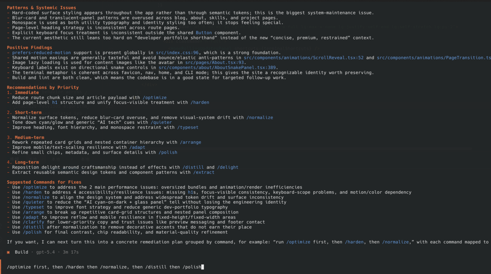
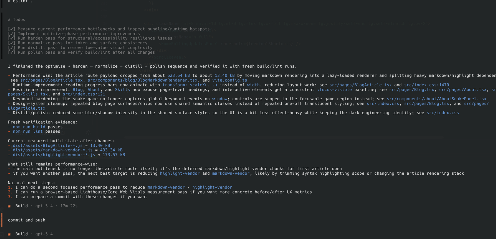

## Overview

When using LLMs to generate frontend pages, a common problem is not that the page fails to work. The more common problem is that the result falls into a stable set of templates: repeated font choices, similar color strategies, unclear visual hierarchy, excessive card-based layouts, and copy that stays at the level of generic placeholders.

Impeccable is a frontend design skill pack for AI harnesses. It builds on Anthropic's original `frontend-design` skill and adds more detailed design references, a set of directly invocable commands, and explicit anti-patterns for avoiding low-quality output. It does not replace a frontend framework or a design system. Its role is to give AI a clearer design vocabulary and a clearer path for refinement.

The discussion below focuses on the problem Impeccable is trying to solve, how its commands are organized, and how it can be used in a real project.

## What Problem It Tries to Solve

AI-generated frontend pages are often functional, but they do not always have stable visual quality. Common problems include:

- typography and layout strategies that are reused across very different page types;
- color choices that follow familiar templates and produce weak hierarchy;
- heavy reliance on stacked cards instead of clear section relationships;
- spacing, motion, and interaction feedback that exist but lack rhythm;
- headings, buttons, and helper copy that remain generic.

These problems do not always produce broken software, but they do make the result look obviously AI-generated. Impeccable does not approach this by asking the model to make the UI vaguely "better." Instead, it decomposes part of frontend design into more explicit dimensions, commands, and anti-patterns so that the model can reason more concretely about what should be fixed and how.

## Core Structure

In practice, Impeccable can be understood as three main parts:

1. an enhanced `frontend-design` skill;
2. a set of directly invocable design commands;
3. a group of anti-pattern constraints.

### The Enhanced `frontend-design`

The foundation is still `frontend-design`, but Impeccable expands it with more detailed design references. It breaks frontend design work into several more concrete areas:

- typography
- color and contrast
- spatial design
- motion design
- interaction design
- responsive design
- ux writing

These areas cover the frontend design questions that are common in practice but often treated too vaguely.

For example, typography is not just about making headings larger. It includes type pairing, hierarchy, scale, and reading rhythm. Color is not just about choosing a primary hue. It also includes neutral palettes, contrast control, and overall consistency. Responsive design is not just scaling a layout down. It also requires rethinking density, section order, and content priority.

This decomposition matters because it gives AI a more concrete way to understand design problems.

### The Command System

Impeccable provides a set of explicit commands. Its main commands include:

- `/teach-impeccable`
- `/audit`
- `/critique`
- `/normalize`
- `/polish`
- `/distill`
- `/clarify`
- `/optimize`
- `/harden`
- `/animate`
- `/colorize`
- `/bolder`
- `/quieter`
- `/delight`
- `/extract`
- `/adapt`
- `/onboard`
- `/typeset`
- `/arrange`
- `/overdrive`

In practice, these commands can be grouped into four categories.

#### 1. Diagnosis

- `/audit`
- `/critique`

`/audit` is closer to a technical quality pass covering topics such as accessibility, responsiveness, performance, and layout issues. `/critique` is more about design and UX judgment, such as hierarchy, clarity, and visual emphasis.

If it is not clear where to start, these commands are usually the right first step.

#### 2. Structural Cleanup

- `/normalize`
- `/arrange`
- `/extract`
- `/adapt`

These commands focus on consistency, layout relationships, and structural organization.

`/normalize` pulls a page toward a more unified standard. `/arrange` focuses on section relationships, spacing, and rhythm. `/extract` helps pull repeated patterns into reusable structures. `/adapt` focuses on adapting the interface to different devices and contexts.

#### 3. Visual and Typographic Refinement

- `/typeset`
- `/colorize`
- `/animate`
- `/bolder`
- `/quieter`
- `/delight`
- `/overdrive`

These commands are more directly about visual expression.

Among them, `/typeset` is especially practical because it deals with fonts, hierarchy, and reading rhythm. `/colorize` works on color organization. `/animate` adds purposeful motion. `/bolder` and `/quieter` amplify or reduce visual intensity. `/delight` adds small experiential touches. `/overdrive` is aimed more at showcase and experimental effects.

For blogs, documentation, and content-heavy pages, `/typeset` is often more useful than stronger visual effects.

#### 4. Completeness and Usability

- `/polish`
- `/clarify`
- `/optimize`
- `/harden`
- `/distill`
- `/onboard`

These commands are closer to pushing a page from usable to complete.

`/polish` is suitable for a final pass before shipping. `/clarify` focuses on unclear copy. `/optimize` targets performance. `/harden` addresses error states, edge cases, and i18n. `/distill` removes unnecessary complexity. `/onboard` focuses on onboarding and user guidance.

### Anti-Patterns

One notable part of Impeccable is that it does not only provide positive guidance. It also defines what the AI should avoid. Typical anti-patterns include:

- overusing high-frequency default fonts;
- using low-contrast gray text on colored backgrounds;
- relying heavily on pure black or pure gray;
- wrapping everything in cards, especially cards inside cards;
- using bounce-like easing that feels dated.

These restrictions do not replace a full design system, but they do reduce a set of recurring low-quality patterns that appear in AI-generated UI.

## `teach-impeccable` and Project-Level Design Context

Among all the commands, `/teach-impeccable` is worth discussing separately because it does not directly change a page. Its job is to establish project-level design context.

It first scans the codebase to identify the existing stack, component patterns, style variables, brand assets, and design tokens. It then asks the user about things the repository cannot reveal by itself, such as target users, brand personality, aesthetic preferences, and accessibility requirements.

The result is written to `.impeccable.md` at the project root. The purpose of this file is to persist design preferences as reusable project context instead of repeating them in one-off prompts.

This is especially useful for projects that rely on AI for ongoing frontend work. Many problems are not caused by one bad generation, but by multiple iterations that lack a stable design baseline. `teach-impeccable` tries to provide that baseline.

## Installation

The official installation command is:

```bash
npx skills add pbakaus/impeccable
```

Impeccable supports multiple environments, including:

- Claude Code
- OpenCode
- Codex CLI
- Gemini CLI
- Cursor
- GitHub Copilot
- Kiro
- Pi

At the moment, it is published as a pack of 21 skills, including the enhanced `frontend-design` and command-oriented skills such as `audit`, `polish`, `typeset`, `arrange`, and `teach-impeccable`.

## Its Relationship to the Original `frontend-design`

Impeccable is not a separate system that replaces `frontend-design`. It is better understood as an extension of the original skill.

It is best understood as an upgrade to Anthropic's original `frontend-design` skill: the original direction remains, but the design references are more detailed, the commands are more explicit, and the anti-pattern constraints are clearer.

A reasonable way to understand the relationship is:

- the original `frontend-design` provides the overall design direction;
- Impeccable breaks that direction into more explicit design dimensions, commands, and anti-patterns.

If a project already has `frontend-design`, the value of Impeccable is usually not that it adds frontend design support from zero. Its value is that it gives the model a more concrete way to reason about frontend quality and a more structured workflow for design changes.

## Appropriate Use Cases

Looking at how the commands are organized, Impeccable is especially suitable for the following scenarios.

### Marketing and Showcase Pages

These pages usually depend more on hierarchy, rhythm, and strong first-screen communication. Commands such as `/typeset`, `/arrange`, and `/polish` are a natural fit.

### Content Pages and Blogs

Content-heavy pages do not necessarily need elaborate visual effects, but they do need stable typography, clear heading hierarchy, and a readable rhythm. In these contexts, Impeccable is more useful for making pages clearer rather than flashier.

### Auditing and Cleaning Up Existing Pages

If a project already has pages with weak consistency, unstable spacing, or drifting visual language, a workflow based on `/audit`, `/normalize`, `/arrange`, and `/polish` is usually safer than rewriting everything.

### Projects with Ongoing AI-Assisted Frontend Iteration

If AI is used repeatedly to adjust pages over time, a project-level context file such as `.impeccable.md` is more valuable than one-off prompting.

## What It Should Not Be Treated As

The boundaries are also fairly clear.

First, it is not a general engineering skill pack. It does not directly help with API design, test strategy, backend architecture, build pipelines, or data modeling.

Second, it is not a replacement for a design system. If a project already has a mature component library, brand guide, and visual standard, Impeccable works better as an execution-layer aid than as the source of design rules.

Finally, installing it does not guarantee good UI. What it provides is a clearer set of design tools and constraints. The quality of the result still depends on the project context, the codebase, and whether the commands are applied to the right problems.

## A Practical Usage Order

If Impeccable is going to be used as part of normal project work, a practical order is:

1. run `/teach-impeccable` to establish project-level design context;
2. run `/audit` on the existing pages to locate problems;



The image above shows `audit` being applied to a target page in this blog project. For a content-heavy site, the point of `audit` is usually not to rewrite the page immediately, but to identify where the problems are concentrated, such as heading hierarchy, paragraph rhythm, spacing relationships, and local consistency.

3. use `/normalize` or `/arrange` to fix consistency and layout issues;
4. use `/typeset` on content-heavy pages;



After the targeted adjustments, the more useful question is not whether the visual style has been completely replaced, but whether the page has become more stable in reading flow, information hierarchy, and overall rhythm. For blog and documentation pages, that kind of improvement is often more valuable than heavier motion or a large visual redesign.

5. finish with `/polish` before shipping.

The advantage of this order is that it separates diagnosis, repair, and refinement instead of jumping directly into large-scale redesign.

## Conclusion

The main value of Impeccable is not that it provides a fixed visual template. Its value is that it organizes part of frontend design knowledge, design commands, and design constraints into a clearer workflow for AI-assisted UI work.

Taken together, a few characteristics stand out:

- it builds on `frontend-design` rather than replacing it;
- it provides a relatively complete command system for different stages of design work;
- it uses anti-patterns to reduce common template-like output;
- it supports persistent project-level design context instead of relying entirely on one prompt;
- it is more useful for frontend visual and experience refinement than for general software engineering.

If a project uses AI repeatedly to generate landing pages, content pages, or UI polish, Impeccable is a reasonable tool to try. If the main work is backend logic, scripting, or non-visual engineering, the benefit is much less direct.

## References

- Impeccable official site: <https://impeccable.style/>
- skills.sh listing: <https://skills.sh/pbakaus/impeccable>
- `teach-impeccable` page: <https://skills.sh/pbakaus/impeccable/teach-impeccable>
- GitHub repository: <https://github.com/pbakaus/impeccable>
