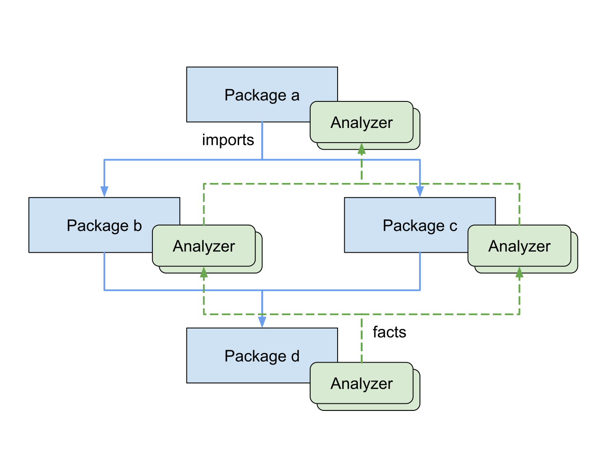

原文链接：[Using go fix to modernize Go code](https://go.dev/blog/gofix)

Go 1.26 带来了一个几乎完全重写的 `go fix` 子命令。它内部集成了一组分析器，用来识别代码中可以升级、简化或现代化的机会，很多时候这些机会来自语言和标准库中的新能力。本文先介绍如何使用 `go fix` 来现代化 Go 代码库，然后再解释它背后的分析基础设施，最后引出 Go 团队正在推动的“自助式”静态分析范式。

## 运行 go fix

和 `go build`、`go vet` 一样，`go fix` 接收一组包模式。要修复当前目录下的所有包，可以直接运行：

```sh
$ go fix ./...
```

执行成功后，命令会直接原地修改源文件。它会自动跳过生成文件，因为那类问题的正确修复对象应该是生成器本身。一个比较实用的习惯是：每次把工程升级到新的 Go 工具链后，都在干净的 git 工作区里跑一次 `go fix`，这样 diff 里只会留下现代化改动，后续 review 也更清晰。

如果想先预览改动，可以加 `-diff`：

```diff
$ go fix -diff ./...
--- dir/file.go (old)
+++ dir/file.go (new)
-                       eq := strings.IndexByte(pair, '=')
-                       result[pair[:eq]] = pair[1+eq:]
+                       before, after, _ := strings.Cut(pair, "=")
+                       result[before] = after
...
```

你也可以查看当前有哪些 fixer：

```text
$ go tool fix help
…
Registered analyzers:
    any          replace interface{} with any
    buildtag     check //go:build and // +build directives
    fmtappendf   replace []byte(fmt.Sprintf) with fmt.Appendf
    forvar       remove redundant re-declaration of loop variables
    hostport     check format of addresses passed to net.Dial
    inline       apply fixes based on 'go:fix inline' comment directives
    mapsloop     replace explicit loops over maps with calls to maps package
    minmax       replace if/else statements with calls to min or max
…
```

要看某个分析器的详细说明，可以继续：

```text
$ go tool fix help forvar

forvar: remove redundant re-declaration of loop variables

The forvar analyzer removes unnecessary shadowing of loop variables.
Before Go 1.22, it was common to write `for _, x := range s { x := x ... }`
to create a fresh variable for each iteration. Go 1.22 changed the semantics
of `for` loops, making this pattern redundant. This analyzer removes the
unnecessary `x := x` statement.

This fix only applies to `range` loops.
```

默认情况下，`go fix` 会运行所有分析器。对于大项目来说，把高产的分析器拆开多次执行，通常更利于代码审阅。你可以用 `-any` 这样的参数只启用某个 fixer，也可以用 `-any=false` 这种形式排除某个 fixer。

和 `go build`、`go vet` 一样，`go fix` 每次只针对某一个具体的构建配置做分析。如果项目里大量使用了特定平台或架构的 build tag 文件，就值得在不同的 `GOOS`、`GOARCH` 组合下多跑几次：

```sh
$ GOOS=linux   GOARCH=amd64 go fix ./...
$ GOOS=darwin  GOARCH=arm64 go fix ./...
$ GOOS=windows GOARCH=amd64 go fix ./...
```

多跑几次除了覆盖更多文件，也可能触发“协同式”修复，后面会提到这一点。

### Modernizers

Go 1.18 引入泛型之后，Go 语言和标准库进入了一个仍然谨慎、但明显更快演进的阶段。很多过去只能手写的循环、分支和辅助函数，现在都能被更现代、更简洁的写法替代，比如用 `maps.Keys` 来替换收集 map key 的循环。

Go 团队还观察到一个实际问题：LLM 编码助手往往会生成和训练语料中旧代码风格一致的 Go 写法，即使已经存在更新、更好的表达方式。如果开源世界本身不完成现代化，那么后续模型仍会持续学到旧习惯。这也是过去一年里 Go 团队持续编写大量 modernizer 的一个背景。

几个典型例子：

- `minmax`：把一组 clamp 风格的 `if` 分支改成 `min` / `max`
- `rangeint`：把三段式 `for` 循环改成 Go 1.22 的整数 `range`
- `stringscut`：把 `strings.Index` + 切片改成 `strings.Cut`

例如，`minmax` 可以把：

```go
x := f()
if x < 0 {
    x = 0
}
if x > 100 {
    x = 100
}
```

改写成：

```go
x := min(max(f(), 0), 100)
```

而 `rangeint` 可以把：

```go
for i := 0; i < n; i++ {
    f()
}
```

改写成：

```go
for range n {
    f()
}
```

这些 modernizer 既内置在 `gopls` 中，能在写代码时提供即时反馈，也内置在 `go fix` 中，方便你一次性对整个包甚至整个仓库做升级。

## 示例：Go 1.26 的 new(expr) modernizer

Go 1.26 为语言规范补上了一个很小但很实用的能力：内建函数 `new` 现在可以直接接收任意值表达式，而不再只接受类型。过去，`new(string)` 只能创建一个零值字符串变量并返回它的地址；在 Go 1.26 中，你可以直接写 `new("go1.26")` 来创建一个初始化为该值的变量。

也就是说，这样的代码：

```go
ptr := new(string)
*ptr = "go1.25"
```

现在可以写成：

```go
ptr := new("go1.26")
```

这个能力在“用指针表达可选值”的场景里尤其有用。过去，开发者经常会引入一个辅助函数来解决这个问题：

```go
type RequestJSON struct {
    URL      string
    Attempts *int
}

data, err := json.Marshal(&RequestJSON{
    URL:      url,
    Attempts: newInt(10),
})

func newInt(x int) *int { return &x }
```

有了 Go 1.26，这样的辅助函数就没有必要了：

```go
data, err := json.Marshal(&RequestJSON{
    URL:      url,
    Attempts: new(10),
})
```

Go 1.26 里的 `newexpr` fixer 就是围绕这个模式设计的。它会识别类似 `newInt` 这种“像 new 一样”的辅助函数，把函数体改成 `return new(x)`，并把调用点也改成直接使用 `new(expr)`。

为了避免过早把新语法引入旧版本文件，modernizer 只会在文件已经声明了足够新的 Go 版本时触发，例如 `go.mod` 里的 `go 1.26`，或者文件上的 `//go:build go1.26`。

要在整个仓库里应用这类修复，可以运行：

```sh
$ go fix -newexpr ./...
```

如果一切顺利，类似 `newInt` 这样的辅助函数很快就会变成未被引用的死代码，此时就可以安全删除。

## 协同式修复

有些修复会创造出应用另一个修复的机会。比如一段限制数值范围的 `if` 链，第一次可能先被改成 `max`，再跑一次之后才会进一步被收敛成 `min(max(...))` 这种形式。不同分析器之间也可能出现这种联动。

例如下面这种在循环里不断拼接字符串的写法：

```go
s := ""
for _, b := range bytes {
    s += fmt.Sprintf("%02x", b)
}
use(s)
```

一个 modernizer 可以先把它改成 `strings.Builder`：

```go
var s strings.Builder
for _, b := range bytes {
    s.WriteString(fmt.Sprintf("%02x", b))
}
use(s.String())
```

而在这一步之后，另一个分析器又可能继续识别出 `WriteString` 和 `Sprintf` 可以合并成 `fmt.Fprintf(&s, "%02x", b)`。因此，`go fix` 很值得多跑一两次，直到没有新的修复出现为止。通常来说，两次就足够了。

### 合并修复与冲突

一次 `go fix` 运行可能会在同一个文件里产生几十处独立修复。可以把它们看成是一组拥有同一个父提交的并行 commit。`go fix` 会用类似三方合并的策略按顺序应用这些 edit；如果新的修复与已累计的改动发生冲突，这个修复就会被丢弃，并提示你再跑一次。

这套机制能很好地处理文本层面的冲突，但语义冲突仍然可能发生。例如两个互不重叠的修复分别删掉了某个局部变量的倒数第二次和最后一次使用，最终变量变成未使用，从而导致编译报错。又比如，一组修复共同使某个 import 失效。因为后者非常常见，`go fix` 会在最后自动执行一次未使用 import 清理。

语义冲突总体不算常见，而且通常会直接表现为编译错误，因此不容易漏掉；但一旦发生，仍然需要人工做一点收尾工作。

## Go 分析框架

从很早开始，Go 就提供了两个静态分析子命令：`go vet` 和 `go fix`。2017 年，Go 团队把当时较为单体化的 `go vet` 重构成“分析器 + 驱动”的分离架构，这就是 Go 分析框架。它的好处是：分析器写一次，就可以跑在很多不同的环境里：

- `unitchecker`：`go vet` 和现在的 `go fix` 所使用的驱动
- `nogo`：适用于 Bazel、Blaze 等替代构建系统
- `singlechecker`：做临时实验和语料测量时很方便
- `multichecker`：面向一组分析器的瑞士军刀式 CLI
- `gopls`：编辑器实时诊断和 quick fix 的基础
- `staticcheck` 的驱动
- Google 内部的 Tricorder 批处理分析管线
- `gopls` 的 MCP server，给基于 LLM 的编码代理提供诊断护栏
- `analysistest`：分析框架的测试基础设施

分析框架还支持一种“辅助型分析器”：它们自己不产出诊断，而是生成可被其他分析器复用的中间数据结构，例如控制流图、SSA、以及高效 AST 导航能力。

另一个重要能力是跨包传播的 “facts”。分析器可以在分析某个包时，把关于某个函数或符号的事实附着到对象上；后续分析另一个包、遇到它的调用点时，就能继续利用这些事实。这让可扩展的跨过程分析成为可能。比如 `printf` 检查器可以推导出 `log.Printf` 本质上是 `fmt.Printf` 的包装，因此也应该按同样规则检查；同样的逻辑还能继续传递到更深层的包装函数。



`go fix` 中的“独立分析”过程，本质上和 `go build` 中的“独立编译”类似：分析器从依赖图底部开始工作，然后把类型信息和 facts 逐层传递给上游导入者。

2019 年，在开发 `gopls` 的过程中，Go 团队又为分析器增加了“给诊断附带修复建议”的能力。例如 `printf` 分析器会提示把 `fmt.Printf(msg)` 改成 `fmt.Printf("%s", msg)`，以避免 `msg` 中恰好含 `%` 时触发误格式化。这一机制后来逐渐成为大量编辑器 quick fix 的基础。

Go 1.26 终于把这整套分析框架也带到了 `go fix` 中。到这一版为止，`go vet` 和 `go fix` 的实现已经高度收敛，主要区别只剩下目标不同：`go vet` 的分析器要尽量以低误报率发现真实错误；`go fix` 的分析器则必须产出可以安全应用、不损伤正确性、性能和风格的修改。

### 改进分析基础设施

随着分析器越来越多，Go 团队也在持续补底层基础设施，目标有两个：一是让单个分析器跑得更快，二是让新的分析器更容易写对。

例如，大多数分析器都要遍历语法树，查找某一类节点。`inspector` 包原本就通过预先构建紧凑索引来提升遍历效率；后来它又加入了 `Cursor` API，使得向上、向下、向左、向右在 AST 中导航都变得高效且可表达。比如下面这个查询就可以很自然地表示“找出所有位于循环体第一条语句位置的 `go` 语句”：

```go
var curFile inspector.Cursor = ...

// Find each go statement that is the first statement of a loop body.
for curGo := range curFile.Preorder((*ast.GoStmt)(nil)) {
    kind, index := curGo.ParentEdge()
    if kind == edge.BlockStmt_List && index == 0 {
        switch curGo.Parent().ParentEdgeKind() {
        case edge.ForStmt_Body, edge.RangeStmt_Body:
            ...
        }
    }
}
```

另一个例子是 `typeindex`。很多分析器一开始都要找某个特定函数的调用，比如 `fmt.Printf`。函数调用在 Go 代码里非常多，如果每次都遍历所有 call expression，再去判断是不是目标函数，成本会很高。`typeindex` 会预先建立符号引用索引，让分析器直接枚举目标符号的调用点。对于像 `hostport` 这种寻找低频符号（如 `net.Dial`）的分析器，这甚至可能带来上千倍的加速。

过去一年里，还有一些其他基础设施改进值得注意：

- 提供了标准库依赖图，帮助分析器避免引入 import cycle
- 支持查询文件的有效 Go 版本，避免插入“过新”的特性
- 扩充了重构 primitive 库，例如“删除这条语句”，并更稳地处理注释与边界情况

当然，分析器和 fixer 的编写仍然很难做得足够稳。因为用户往往会一次性应用数百处修复，只做轻量 review，所以即使是很偏的边界情况也必须保证正确。文中给出的一个例子是：团队曾经做过一个把 `append([]string{}, slice...)` 替换成 `slices.Clone(slice)` 的 modernizer，但后来发现当 `slice` 为空时，`Clone` 返回的是 `nil`，这在少数场景下会引发行为变化，因此最终不能把这个 modernizer 纳入 `go fix` 套件。

更好的文档、更好的语法树模式匹配、更丰富的 edit primitive、更强的测试基础设施，都还在路线图中。

## “自助式”范式

更进一步看，Go 团队在 2026 年开始把重点转向一种“self-service”范式。

前面提到的 `newexpr` 是一个很典型的 bespoke modernizer：它是为某个具体特性量身定做的。这个模式对于语言本身和标准库非常有效，但对第三方包并不够友好。理论上，你当然可以为自己的 API 写一个 modernizer，也可以在自己的项目里使用它，但要让 API 的所有使用者都能方便跑到这个 modernizer，当前仍然会受到审查、审批和发布节奏的限制。

在 self-service 范式下，Go 开发者应该能够为自己的 API 定义现代化迁移规则，并让下游用户直接应用，而不必每次都依赖集中式流程。随着 Go 社区和全局代码语料增长速度越来越快，这一点变得尤其重要。

Go 1.26 已经给出了这条路线的第一个预览：基于注解驱动的源码级内联器。未来一年，Go 团队还计划探索两个方向。

第一，是探索如何从源码树中动态加载 modernizer，并在 `gopls` 或 `go fix` 中安全执行。这样一来，一个数据库库的维护者就可以直接随包发布针对其 API 的误用检查，例如 SQL 注入风险、关键错误遗漏等；项目维护者也可以把内部工程规范写成分析器，比如禁止调用某些问题函数，或对关键模块施加更严格的编码纪律。

第二，是把大量现有的“做完 X 别忘了做 Y”类分析器泛化出来，例如：

- 打开文件后记得关闭
- 创建 context 后记得 cancel
- 加锁后记得解锁
- iterator 中 `yield` 返回 `false` 后记得退出循环

这类检查的共同点是：它们本质上都在约束控制流路径上的不变量。Go 团队希望能把这类分析统一起来，让开发者只需要通过注解自己的代码，就能把这些控制流约束扩展到新的业务领域，而不必手写复杂的分析逻辑。

整体目标并不复杂：让维护 Go 项目的升级工作更省力，让新特性能更早真正进入代码库，也让分析能力从 Go 核心团队主导的集中式模式，逐步扩展到更开放的生态自服务模式。Go 团队也鼓励开发者在真实项目里尝试 `go fix`，并继续反馈新的 modernizer、checker、fixer 和 self-service 分析思路。
