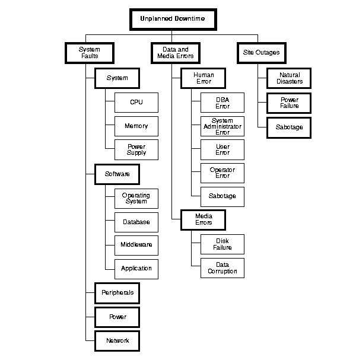
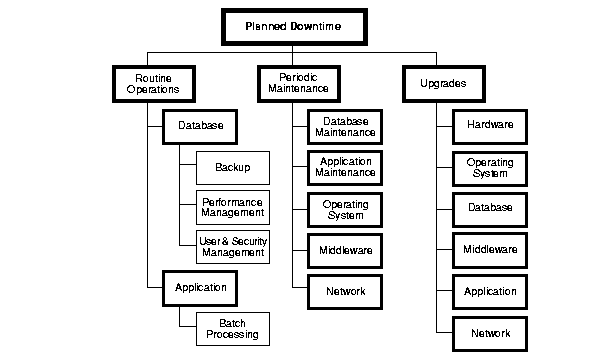
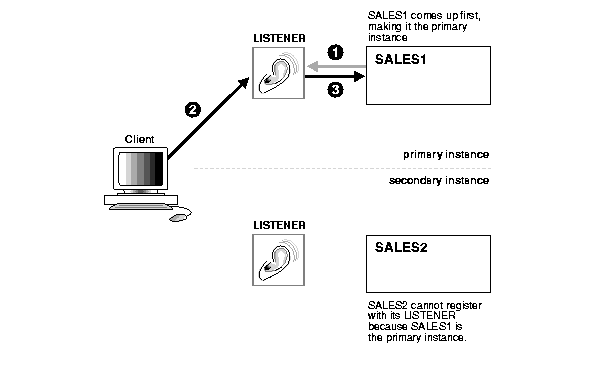
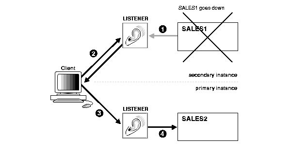
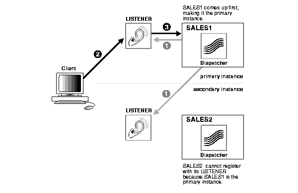
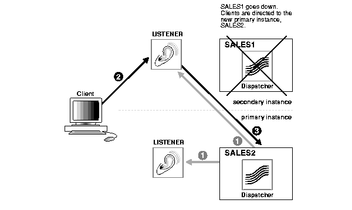

原文链接：[High Availability Concepts and Best Practices](https://docs.oracle.com/cd/A91202_01/901_doc/rac.901/a89867/pshavdtl.htm)

# 高可用概念与最佳实践

本章介绍在 Oracle Real Application Clusters（RAC）环境中实现高可用时需要理解的核心概念与常见最佳实践，重点包括停机类型、故障切换、恢复流程，以及几种典型的高可用部署形态。

## 理解高可用

高可用系统是指通过硬件与软件冗余，把服务可用时间尽量拉满的计算环境。设计良好的高可用系统不会留下单点故障；任何可能失效的组件都应有可接管的等价冗余。

当故障发生时，系统需要通过故障切换把失败组件承担的工作转移到备份组件，同时完成资源重新归属、未完成事务恢复和服务重建。切换对用户越透明，系统的可用性就越高。

Oracle 可以通过 RAC、Oracle Real Application Clusters Guard、Oracle Replication 与 Oracle9i Data Guard 等能力组合来满足不同层级的高可用需求。RAC 本身就是一种天然面向高可用的体系，在计划停机与非计划停机场景下都能持续提供服务。

Real Application Clusters 环境中的集群，如 [Chapter 3](https://docs.oracle.com/cd/A91202_01/901_doc/rac.901/a89867/pshwarch.htm#6175) 所述，能够在计划停机和非计划停机下继续提供连续服务。

**Note:**

关于高可用的更多讨论，也可以继续参考 [Chapter 11](https://docs.oracle.com/cd/A91202_01/901_doc/rac.901/a89867/opfsarch.htm#41868) 和 [Chapter 12](https://docs.oracle.com/cd/A91202_01/901_doc/rac.901/a89867/opfsoper.htm#43583)。这两个章节从 Oracle Real Application Clusters Guard 的角度继续展开高可用话题。

### 衡量可用性

不同系统对可用性的要求并不相同。邮件、互联网服务等关键业务系统，通常比用户规模较小的应用更需要高可用；有些业务要求 7x24 连续在线，另一些则只在特定业务时间段内要求“近连续在线”。

### 高可用指标

业界通常使用两类指标来衡量可用性：

- 平均恢复时间（MTTR）
- 平均故障间隔时间（MTBF）

在多数故障场景下，更重要的是尽量降低 MTTR，也就是在故障发生后尽快恢复服务。由于 RAC 可以通过去除单点故障来降低组件故障对业务可用性的直接影响，因此从应用可用性的角度看，它能显著改善系统表现。

另一个常见指标是“几个 9”。例如，全年不可用时间约 526 分钟对应 99.9% 可用性；全年不可用时间约 5 分钟则对应 99.999% 可用性。要真正达到更高位数的可用性，除了架构本身，还依赖严格的变更管理、测试流程与运行规范。

### 停机原因

停机既可能是计划内的，也可能是计划外的。Figure 10-1 展示了 [**非计划停机**](https://docs.oracle.com/cd/A91202_01/901_doc/rac.901/a89867/glossary.htm#433793) 的多种来源，它们大致可以归类为系统故障、数据与介质错误，以及站点级故障。之所以破坏性更强，是因为其发生时间通常难以预测。

#### *图 10-1 非计划停机的原因*

计划停机同样可能严重影响业务，尤其是在跨时区运行的全球化系统中。Figure 10-2 展示了几类常见的计划停机，通常可以归纳为日常运维、周期性维护与升级。

#### *图 10-2 计划停机的原因*

构建高可用系统的关键，不只是识别故障本身，而是面向这些停机来源设计一整套可承受的架构。Oracle Real Application Clusters Guard 的目标正是降低计划内与计划外停机对数据库服务与最终用户的影响。

## 高可用规划

高可用不是靠单个组件“堆出来”的，而是系统性规划和审慎设计的结果。规划通常需要同时从两层展开：

- 系统层面的整体规划
- 面向故障保护的细粒度规划

### 系统层规划

系统层规划主要包括：

- 容量规划
- 冗余规划

#### 容量规划

一个系统只有在能够按业务要求及时处理事务时，才算真正“可用”。因此，高可用设计不能脱离容量问题单独讨论。足够的 CPU、内存、I/O 和网络资源，是维持持续可用性的前提。

如果应用当前运行在单机 SMP + 单实例 Oracle 上，那么通常的增长路径是迁移到更大的 SMP 机器；如果硬件产品线不支持这条路径，迁移到 RAC 往往是更自然的方案。RAC 允许通过增加节点扩展容量，同时把对现有在线事务的干扰控制在较低水平。

#### 冗余规划

冗余规划的目标是复制关键系统组件，使任何单个组件失效都不会直接导致服务不可用。高端 SMP 设备常见的冗余电源、冗余风扇就是这种思路的体现；RAC 则把这种冗余进一步扩展为整机级、节点级和存储级的整体冗余，从而最大限度消除单点故障。

**Note:**

建设高可用系统时，应确保硬件与软件组合经过认证，并作为整体进行规划和验证。

## 为高可用配置 Oracle RAC

RAC 在标准 Oracle 特性的基础上进一步提升了可用性。许多单实例场景下的高可用能力，例如 Fast-Start Recovery、在线重组等，同样适用于 RAC。Fast-Start Recovery 可以缩短 MTTR，而在线重组可以降低计划停机时长。

除此之外，RAC 还利用集群带来的冗余，在 *n* 节点集群中提供最多 *n-1* 节点失效下的持续服务能力。只要集群中还剩至少一个存活节点，用户就仍然可以访问全部数据。

### 集群组件与高可用

设计 RAC 高可用时，需要重点关注以下集群组件：

- 集群节点
- 集群互连
- 存储设备
- 操作系统与集群管理器
- 数据库软件

See also:
[Chapter 3](https://docs.oracle.com/cd/A91202_01/901_doc/rac.901/a89867/pshwarch.htm#6175)

#### 集群节点

RAC 的所有节点都能访问同一组共享数据文件，因此单个节点故障不会阻止其他节点继续处理事务。只要集群还有一个幸存节点，客户端就仍然能够访问全部数据，只是剩余节点可能因承载更多工作而出现响应时间上升。

#### 集群互连

在集群设计中，互连冗余经常被忽视，因为其 MTTF 通常较长，且高等级冗余互连会显著增加成本。但如果没有互连冗余，系统就不能算真正摆脱了单点故障。

互连问题不只来自硬件故障，也可能来自配置错误或人为失误，例如交换设备振荡器失效、接线问题或运维误操作。因此，互连本身也应被纳入高可用设计。

#### 存储设备

RAC 使用单一数据映像，所有节点共同访问相同的数据文件集合。与单实例 Oracle 一样，底层存储仍然需要依赖硬件镜像或 RAID 等手段提供介质冗余；否则，RAC 只能解决节点与实例层面的故障，无法解决底层数据副本丢失问题。

#### 操作系统与集群管理器

每个节点都有自己的操作系统副本，集群管理器又建立在操作系统之上。因此，节点级冗余也意味着操作系统和集群管理器层面具备天然冗余：只要集群中仍有其他节点正常运行，这一层就仍然存在接管基础。

#### 数据库软件

在 RAC 中，Oracle 可执行文件通常安装在各节点本地磁盘上，而每个节点上运行一个实例；如果系统支持集群文件系统，也可能只保留一份 Oracle Home。无论具体安装方式如何，所有实例都能访问相同数据并处理任意事务，因此数据库软件层面同样是冗余的。

## 灾难规划

RAC 主要是同站点高可用方案：节点通常位于同一机房，甚至同一房间。因此，面向火灾、洪水、地震、飓风、恐怖袭击等站点级灾难的规划仍然不可或缺。

在这类场景下，可以把 RAC 与 Oracle9i Data Guard、Oracle Replication 等能力结合起来：一套集群承载主库，另一套异地系统或远端集群承载灾备库。也就是说，RAC 解决的是高可用的一部分，而完整的灾难恢复仍需要更上层的容灾设计。

## 故障保护校验

完成系统层面的规划后，还需要验证你的 RAC 环境是否真正覆盖了主要故障类型。本文建议从以下故障来源出发进行验证与排查：

- 集群组件
- CPU
- 内存
- 互连软件
- 操作系统
- 集群管理器
- Oracle 数据库实例介质
- 控制文件损坏或丢失
- 日志文件损坏或丢失
- 数据文件损坏或丢失
- 人为错误
- 数据库对象被误删

RAC 对集群组件故障和相当一部分软件故障有较好的容错能力，但介质故障与人为错误仍可能直接导致停机。由于整个集群共享同一组数据库文件，介质层的问题不会因为节点冗余而自动消失。

因此，即使已经部署 RAC，也仍应采用底层存储冗余、备份恢复、审计、变更控制和误操作保护等最佳实践，以降低文件损坏、对象误删等问题的影响。

## 故障切换与 Real Application Clusters

高可用系统要真正做到故障切换，首先必须有准确的实例监控与心跳机制。除了日常运行时保持这套机制可用，系统还必须在故障切换发生时快速、准确地重新同步资源、完成成员重组和恢复动作。

### 故障切换基础

故障切换并不是单一步骤，而是一整套协调动作：检测故障、判断集群成员关系、转移资源归属、恢复失败实例上的工作，并在对用户尽可能透明的前提下恢复业务服务。

### 故障切换时长

故障切换持续时间取决于用户类型：

- 对已连接用户，既包含服务端故障切换，也包含客户端侧重新连接与恢复动作。
- 对新进入的用户，只体现为服务端故障切换处理时长。

### 客户端故障切换

从数据库客户端的视角看，理想的高可用系统应该尽可能屏蔽后端节点故障。这些客户端既可能是传统 C/S 应用，也可能是多层应用中的中间层数据库连接。配置得当时，故障切换机制会把客户端会话透明地重定向到集群中的可用节点，这就是 Oracle 所说的 TAF。

#### 透明应用故障切换

**Transparent Application Failover (TAF)** 允许应用在连接失效时自动重新连到数据库。正在进行的事务会回滚，但新建立的连接会在语义上尽量保持与旧连接一致，而且无论连接因何种原因中断，这一行为都成立。

#### TAF 的工作方式

只要集群中仍有至少一个实例继续提供服务，客户端就几乎感知不到连接丢失。DBA 可以控制每个应用运行在哪些实例上，并为应用配置故障切换顺序。

从客户端角度看，原来的数据库连接失效后，Oracle 会自动建立一条新连接，使用户能够继续工作，尽量接近“原连接从未失效”的体验。

#### TAF 影响到的元素

TAF 影响的对象包括：

- 客户端/服务器数据库连接
- 正在执行命令的用户会话
- 正在取数的打开游标
- 活跃事务
- 服务端程序变量

TAF 能自动恢复其中一部分，但并不是所有状态都能原样保留。某些元素仍需要应用程序显式配合，才能实现真正透明的故障切换。

### TAF 的用途

除了在节点故障时保住客户端会话，TAF 在以下场景也很有价值：

- 事务性关闭
- 数据库静默（quiesce）
- 负载均衡
- 查询客户端在故障切换期间的处理

#### 事务性关闭

如果要在尽量不影响用户的情况下摘除某个节点，可以使用 `SHUTDOWN TRANSACTIONAL` 或 `SHUTDOWN TRANSACTIONAL LOCAL` 等方式，在事务边界上延迟关闭，让现有事务先完成，再把会话平滑迁移到其他实例。

#### 数据库静默

数据库静默可以在某些维护场景下暂停新的工作进入系统，从而为后续切换、维护或资源重整提供更稳定的窗口。它本质上是把可用性设计前移到“有控制地收敛流量”这个环节。

#### 负载均衡

TAF 并不只在故障发生后起作用，它与连接分发策略结合时，也能改善高可用系统在正常运行阶段的负载分配。常见策略包括按节点负载、按实例负载或按调度器负载进行引导。

#### TAF 的限制

TAF 不是万能的，它存在一些明确限制：

- 服务端 PL/SQL 包状态会在故障切换后丢失
- `ALTER SESSION` 状态不会自动保留
- 若事务中途发生故障切换，后续调用可能持续报错，直到应用主动执行回滚
- 已失效游标上的继续操作可能报错
- 如果故障切换后的第一条命令不是 `SELECT` 或 `OCIStmtFetch`，就可能看到错误

因此，应用在使用 TAF 时，必须明确知道哪些状态会被恢复、哪些状态需要自己补偿。

#### 故障切换期间的数据库客户端处理

查询型客户端与 Database Mount Lock 客户端在故障切换期间的处理方式并不相同，但共同目标都是尽量把故障对现有连接的影响掩蔽掉。

对于查询客户端，进行中的查询会在故障切换后从头重新发起，因此如果原查询本来就很长，下一次响应时间可能会明显增加。若幸存节点的 buffer cache 已经缓存了相关数据，则额外成本会更小。TAF 的 `PRECONNECT` 模式可以进一步降低重连时间，但会提前预留更多资源。

### 服务端故障切换

#### 基于主机的故障切换

在传统 host-based 系统中，故障切换通常包含以下步骤：

1. 通过心跳检测故障
2. 在集群管理器中重组成员关系
3. 把磁盘归属从主节点转移到备节点
4. 重启应用与数据库二进制
5. 执行应用与数据库恢复
6. 让客户端重新连接到接管节点

#### RAC 故障切换

与 host-based 模式相比，RAC 的故障切换更强调共享存储与多实例协调带来的持续服务能力。所有实例都面向同一份数据映像，因此节点故障之后，恢复工作的重点是重新分配缓存与实例资源，并让幸存节点接手业务。

## 故障切换是如何工作的

从实现角度看，RAC 的故障切换主要分为三步：

- 检测故障
- 重组集群成员关系
- 执行数据库恢复

### 检测故障

故障检测依赖心跳与实例监控机制。系统需要快速识别哪些成员已不再正常响应，以便启动后续成员裁定与恢复流程。

### 重组集群成员关系

成员关系重组是 RAC 的关键环节。它决定谁仍然属于当前集群、谁应被踢出，以及哪一组存活节点有资格继续对外服务。

Oracle 在这里依赖一套称为 **Instance Membership Recovery (IMR)** 的机制来完成成员仲裁与控制文件投票。它的核心职责包括：

- 确保成员之间通信可用，且节点具备正常响应能力
- 剔除已经不再活动的成员
- 通过控制文件上的位图与投票记录来协调成员资格
- 基于通信失败或心跳超时识别“过期”成员
- 在仲裁后锁定最终成员结果

### 执行数据库恢复

成员关系稳定后，系统需要继续推进数据库恢复，主要包括两个层面：

- 重新主控失败实例持有的全局缓存资源
- 执行实例恢复

#### 重新主控失败实例的全局缓存服务资源

当某个实例失败时，它原先负责的一部分全局缓存资源必须被重新分配给幸存实例。这一过程是后续恢复与重新服务流量的前置条件。

#### 实例恢复

实例恢复通常包括：

- 回滚失败实例上所有未提交事务，也就是事务恢复
- 重放失败实例的在线重做日志

通过这两步，系统把失败实例留下的不一致状态清理干净，并恢复到可继续服务的稳定点。

## 高可用配置

RAC 的高可用配置并不只有一种。不同业务规模、性能目标和成本约束，会对应不同的部署形态。

### 默认 *n* 节点配置

默认的 *n* 节点配置是最标准的 RAC 使用方式：所有节点都处于活跃状态，并同时对外提供服务。

#### *n* 节点配置的收益

这种模式的优点包括：

- 所有节点都能同时承担业务负载
- 节点失效后，工作负载可以分摊到其他节点
- 更容易把可扩展性和高可用性统一在同一套架构里

### 基础高可用配置

对于某些业务，并不一定需要所有节点同时对外提供相同的流量。此时可以采用更基础但更容易控制的高可用配置，例如 Primary/Secondary 实例模式。

#### 远程客户端

在面向远程客户端时，连接字符串、监听器配置以及重连策略会直接决定故障切换体验。地址列表与连接故障切换配置可以帮助客户端在主节点失效后自动尝试新的入口。

#### 专用服务器环境中的 Primary/Secondary 实例

在这种模式下，一个实例作为主实例对外服务，另一个实例保持次实例身份，并在故障时接管。

#### *图 10-3 专用服务器环境中的主/备实例特性*

在节点故障发生前，典型状态包括：

1. `SALES1` 与监听器保持连接
2. 客户端与监听器交互
3. `SALES1` 为主实例
4. `SALES2` 将成为次实例

#### *图 10-4 专用服务器环境中的节点故障*

当主实例失效时，典型步骤如下：

1. 检测到 `SALES1` 失败
2. 客户端对失效监听器的重连请求被拒绝
3. 次实例完成恢复并提升为新的主实例
4. 客户端重新提交请求后，通过新的主实例监听器自动重建连接

#### 主/备实例与共享服务器

在共享服务器模式下，RAC 通过集群内所有 dispatcher 与 listener 的交叉注册来提升重连性能。

这种模式下，主实例的 dispatcher 会把自己以主实例身份注册到两个监听器上，因此客户端可以通过任意一个监听器找到当前主实例。

See also:
[*Oracle9i Real Application Clusters Installation and Configuration](https://docs.oracle.com/cd/A91202_01/901_doc/rac.901/a89868/toc.htm)

#### *图 10-5 共享服务器环境中的主/备实例特性*

经过特殊配置的客户端还可以把批处理任务放到次实例上，例如报表或索引创建，从而减少对主实例在线事务的影响。

See also:
[*Oracle9i Real Application Clusters Installation and Configuration](https://docs.oracle.com/cd/A91202_01/901_doc/rac.901/a89868/toc.htm)

图 10-6 展示了主实例失效后如何由新的主实例替代旧主实例。

1. 主节点失效后，次实例中的 dispatcher 会把自己注册为新的主实例
2. 客户端向任一监听器发起重连
3. 监听器把请求转发到新主实例的 dispatcher

#### *图 10-6 共享服务器环境中的节点故障*

#### 在次实例上预热 Library Cache

为了让故障切换后的性能尽快恢复，可以提前把主实例 library cache 中常用 SQL 和 PL/SQL 的信息复制到次实例。Oracle 将这一过程称为 **warming the library cache**。

这可以减少切换后重新解析 SQL 与重新编译 PL/SQL 所需的时间，让新的主实例更快恢复到接近原有性能的状态。

See also:
[*Oracle Real Application Clusters Guard Administration and Reference Guide](https://docs.oracle.com/cd/A91202_01/901_doc/rac.901/a88810/toc.htm)  
[*Oracle9i Supplied PL/SQL Packages Reference](https://docs.oracle.com/cd/A91202_01/901_doc/appdev.901/a89852/toc.htm)

#### 基础高可用配置的收益

Primary/Secondary 模式相对于默认两节点同时对外模式，有几个显著优点：

- 提供平滑过渡到 *n* 节点配置的路径
- 对于不需要横向扩展到多节点的应用，也能提供高可用
- 性能更接近单实例数据库
- 在很多情况下不需要复杂调优

#### 向 *n* 节点配置过渡

Primary/Secondary 模式为从单实例架构演进到 RAC 提供了一条更平滑的路径。因为任一时刻主要只有一个节点承载主要事务，调优与故障排查都更聚焦，数据库管理员可以逐步适应 RAC 的运行和管理方式。

### 共享高可用节点配置

在某些场景下，让一个节点长期空闲只为接管故障成本太高，但所有节点都完全同构承载全部服务也未必合适。此时可以考虑“共享高可用节点”配置。

这种模式下，多个节点分别运行不同应用模块或服务，所有应用服务共享同一个 RAC 数据库；另有一个专门的接管节点，平时不承接正常业务流量。一旦某个应用节点失效，系统可以把对应工作负载切到这个接管节点上。

这种模式特别适合由中间层应用或事务处理监视器统一调度用户到不同节点的系统。与 Primary/Secondary 不同，它并没有数据库层自动完成工作负载迁移的机制，因此应用或中间件必须负责把用户从失效节点切到接管节点，并在原节点恢复后决定是否回切。

#### 共享高可用节点配置的收益

这种配置的主要优点是：在故障切换发生时，应用性能更容易保持稳定。相比之下，默认 *n* 节点模式在丢失一个节点后，需要把同样的工作负载重新分摊到更少的节点上，性能可能出现约 `1/n` 级别的下降。

## 走向高可用部署

部署在集群系统上的 Oracle RAC 能提供完整的冗余环境，并具备很强的容错能力。高可用在 RAC 中首先是一个架构问题：所有集群节点上的活跃实例都平等访问同一份数据；当某个节点失效时，其他幸存实例仍然可以继续对外提供全部数据访问；失败节点上的未完成事务则由第一个检测到故障的节点进行恢复。

因此，在 RAC 架构下，节点故障不会直接等于业务不可用。它带来的更多是恢复、重分配与重连成本，而不是服务彻底中断。这也是 RAC 能在数据库高可用场景下长期被采用的根本原因。
