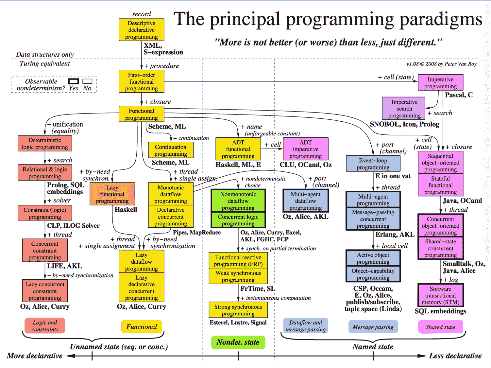

编程范式，可以理解为一种组织代码与建模问题的方式。不同范式体现了对计算过程、状态管理和程序结构的不同理解，也会进一步影响代码的表达方式、扩展能力与复用程度。

本文主要对几种常见的编程范式作简要介绍，同时也将其视为现阶段学习内容的一次整理与总结。

## 一、范式概览



这张图展示的是，从最初的描述性语言出发，在不断叠加不同语义机制之后，逐步分化出的各类编程范式。图中的箭头大多可以理解为“在已有模型上再加入一种能力”，例如 closure、cell、thread、search、port、constraint。随着这些机制不断引入，一阶函数可以扩展为函数式编程，函数式又可以因可变状态而转向命令式。所谓“范式”，本质上只是这些机制的不同组合方式。

图的横轴大致体现了一条从“更声明式”到“更少声明式”的过渡。越靠左，程序越倾向于描述关系、约束和依赖，编码更像是在定义“什么成立”；越靠右，程序越倾向于操纵状态、控制流程和组织交互，编码更像是在指定“如何执行”。前者通常更强调表达与推理，后者通常更强调状态管理与工程实现。

也可以看到，许多语言往往同时混合了多种编程范式。所谓范式，无非是在不同位置上，对这些基本问题给出不同的回答。

## 二、函数式编程

### 2.1 函数式编程的发展路径

从图中可以看到，函数式编程是由一阶函数式编程在引入 closure 之后逐步发展出来的。闭包的意义在于，函数不再只是单纯的“可调用过程”，而成为可以携带环境、作为值传递和返回的对象。也正是在这一点上，函数真正具备了一等公民的地位，函数式编程才拥有了完整的表达能力。

继续沿着这条路径向下看，还会出现 lazy functional programming、dataflow programming、FRP 等分支。函数式编程强调的是把计算看作函数映射，并在此基础上以相同的思想进行逐步扩展。

### 2.2 函数式编程的特点

函数式编程主要关心的是输入到输出之间的映射关系，也就是函数本身。与命令式编程强调“状态如何一步步变化”不同，函数式更强调“一个表达式如何被计算为另一个值”。在较为典型的函数式风格中，通常会体现出以下几个特征：

- **强调纯函数**：相同输入应当得到相同输出，函数的行为尽量不依赖外部可变状态。
- **强调不可变性**：数据一旦构造完成，通常不直接修改，而是通过生成新值来表达变化。
- **强调组合**：程序通过函数的嵌套、连接与变换来构造，而不是主要依赖过程式步骤推进。
- **弱化共享可变状态**：I/O、全局状态修改、共享变量写入等通常被隔离或显式处理。

### 2.3 函数式的常见技术

函数式编程之所以有较强的表达能力，很大程度上依赖于若干常见技术与抽象方式：

- **高阶函数**：函数可以接收函数作为参数，也可以返回函数。
- **Map / Filter / Reduce**：将遍历、筛选、聚合等操作抽象为通用组合子。
- **Pipeline**：将多个处理阶段串联，使数据沿着固定方向逐步变换。
- **Currying**：将多参数函数转换为一系列单参数函数，便于组合与局部应用。
- **Lazy Evaluation**：延迟求值，仅在真正需要结果时才计算。
- **Iterator / Stream**：用连续的数据变换替代显式循环控制。

### 2.4 一个简单的函数式风格

在实际使用中，函数式更强调“通过迭代器组合表达计算过程”，弱化显式循环和外部可变状态。以接雨水为例，一般的命令式版本如下：

```rust
pub fn trap_imperative(height: Vec<i32>) -> i32 {
    let n = height.len();
    if n == 0 {
        return 0;
    }

    let mut pre = vec![0; n];
    let mut suf = vec![0; n];

    pre[0] = height[0];
    for i in 1..n {
        pre[i] = pre[i - 1].max(height[i]);
    }

    suf[n - 1] = height[n - 1];
    for i in (0..n - 1).rev() {
        suf[i] = suf[i + 1].max(height[i]);
    }

    let mut ans = 0;
    for i in 0..n {
        ans += pre[i].min(suf[i]) - height[i];
    }

    ans
}
```

这段代码的特点比较直接：先构造前缀最大值数组与后缀最大值数组，再通过一个循环完成累加。整个求解过程建立在多个显式变量的逐步更新之上，状态变化是展开给读者看的。

而一个更偏函数式风格的版本如下：

```rust
pub fn trap_functional(height: Vec<i32>) -> i32 {
    let pre: Vec<i32> = height
        .iter()
        .scan(0, |mx, &h| {
            *mx = (*mx).max(h);
            Some(*mx)
        })
        .collect();

    let suf: Vec<i32> = height
        .iter()
        .rev()
        .scan(0, |mx, &h| {
            *mx = (*mx).max(h);
            Some(*mx)
        })
        .collect::<Vec<_>>()
        .into_iter()
        .rev()
        .collect();

    height
        .iter()
        .zip(pre.iter())
        .zip(suf.iter())
        .map(|((&h, &l), &r)| l.min(r) - h)
        .sum()
}
```

这一版本并没有改变算法本身，改变的是表达方式。前缀最大值和后缀最大值通过 `scan` 构造，最终答案通过 `map` 与 `sum` 推导出来，显式的累加变量被替换为一条较为连续的变换链。它当然并不是严格意义上的纯函数式代码，但已经体现出明显的函数式风格：程序员不再直接指挥每一步如何执行，而是更倾向于描述数据如何被连续变换。

## 三、面向对象编程

### 3.1 OOP 概述

如果说函数式更倾向于将程序理解为值到值的变换，那么面向对象则更倾向于将程序理解为一组对象之间的协作。对象拥有内部状态，暴露方法，对外形成边界；程序运行时，系统的行为往往表现为这些对象之间的消息调用、方法分派与状态变化。也正因如此，OOP 更接近现实世界中的实体建模方式，在大型业务系统中尤为常见。

### 3.2 OOP 的主要特点

面向对象编程通常围绕以下几个关键词展开：

- **封装（Encapsulation）**：将数据与操作数据的方法组织在一起，对外隐藏内部实现细节。
- **抽象（Abstraction）**：只暴露必要接口，屏蔽不必要的内部结构。
- **继承（Inheritance）**：通过已有类型扩展新类型，复用已有行为。
- **多态（Polymorphism）**：统一接口下允许不同实现，提高扩展性。

不过从实践角度看，真正重要的并不只是这些概念本身，而是它们背后的组织方式：OOP 更关心系统中有哪些实体，这些实体有什么状态，它们彼此如何交互，以及职责应当如何划分。它擅长处理具有身份、生命周期和协作关系的问题，例如用户、订单、会话、连接、任务调度器等。

与函数式相比，OOP 对状态的态度完全不同。函数式通常试图弱化或隔离状态，而 OOP 则承认状态是系统建模中的核心部分，并试图通过封装、对象边界和接口设计来管理状态的复杂度。

### 3.3 一个 OOP 风格的例子

同样以接雨水为例，如果采用面向对象风格，可以将数据与求解逻辑封装在一个结构体中：

```rust
pub struct RainWaterTrapper {
    height: Vec<i32>,
    pre: Vec<i32>,
    suf: Vec<i32>,
}

impl RainWaterTrapper {
    pub fn new(height: Vec<i32>) -> Self {
        let n = height.len();
        Self {
            height,
            pre: vec![0; n],
            suf: vec![0; n],
        }
    }

    fn build_prefix_max(&mut self) {
        if self.height.is_empty() {
            return;
        }

        self.pre[0] = self.height[0];
        for i in 1..self.height.len() {
            self.pre[i] = self.pre[i - 1].max(self.height[i]);
        }
    }

    fn build_suffix_max(&mut self) {
        if self.height.is_empty() {
            return;
        }

        let n = self.height.len();
        self.suf[n - 1] = self.height[n - 1];
        for i in (0..n - 1).rev() {
            self.suf[i] = self.suf[i + 1].max(self.height[i]);
        }
    }

    fn calculate_water(&self) -> i32 {
        let mut ans = 0;
        for i in 0..self.height.len() {
            ans += self.pre[i].min(self.suf[i]) - self.height[i];
        }
        ans
    }

    pub fn solve(&mut self) -> i32 {
        self.build_prefix_max();
        self.build_suffix_max();
        self.calculate_water()
    }
}

pub fn trap_oop(height: Vec<i32>) -> i32 {
    let mut trapper = RainWaterTrapper::new(height);
    trapper.solve()
}
```

这个版本与命令式版本在算法上并没有区别，但在结构上已经体现出 OOP 的组织方式：`height`、`pre`、`suf` 被封装在同一个对象中，前缀构造、后缀构造和结果计算被拆分为对象方法，求解过程则由 `solve` 统一调度。换句话说，程序不再只是“一串步骤”，而是“由一个对象负责自身状态并完成任务”的结构。

### 3.4 OOP 与函数式的区别

从整体上看，二者的差异主要体现在关注点不同：

- 函数式更关注计算与组合。
- OOP 更关注实体、状态与协作。
- 函数式倾向于减少可变状态，OOP 倾向于封装并管理状态。
- 函数式强调表达式与变换，OOP 强调对象边界与职责划分。

不过在真实语言与工程实践中，它们通常并不是对立关系。很多现代语言都会同时提供闭包、迭代器、对象封装、接口抽象等能力；而在实际项目中，也常常会同时使用函数式与面向对象的写法。前者适合表达局部变换与组合逻辑，后者适合组织模块边界与长期状态。

## 四、其他范式

### 4.1 命令式编程

它以状态变化和顺序执行为核心，通过变量、赋值、循环和条件分支来驱动程序运行。相较于函数式的组合式表达，命令式更接近机器执行模型，也更便于直接控制资源与流程。C、Pascal 这类语言都可以看作这一方向的典型代表。

### 4.2 逻辑编程与约束编程

逻辑编程与约束编程属于更偏声明式的分支。这类范式并不主要关心“步骤如何执行”，而更关心“哪些关系成立”“哪些条件必须满足”。例如在逻辑编程中，可以通过事实、规则和查询来描述问题；在约束编程中，则可以把调度、分配、求解等问题表述为一组约束条件，由系统负责寻找满足条件的解。它们更像是在编写求解器，而不是手工编排执行过程。

### 4.3 并发编程与消息传递

由 thread、port、message passing 等机制引出的并发分支。并发并不只是“多个线程一起跑”，更重要的问题在于：这些执行单元如何共享或不共享状态，如何通信，以及如何避免冲突。共享状态并发、消息传递并发、Actor 风格、多智能体编程，本质上都是在回答这一问题。随着系统规模扩大，这部分内容往往比单纯的语法特性更重要。

### 4.4 数据流与响应式编程

这类范式强调的是依赖传播与时间维度下的计算组织方式。程序不再只是按照固定语句顺序执行，而可能随着数据可用、事件到达或时间推进而触发新的计算。在前端响应式系统、流处理系统以及实时控制领域，这种思想都相当常见。

## 五、总结

编程范式并不是若干孤立标签的堆叠，而是一组关于计算、状态、控制、通信与组织方式的不同回答。函数式强调变换与组合，面向对象强调实体与协作，命令式强调状态推进，逻辑与约束强调关系与求解，并发与消息传递则进一步把问题扩展到多个执行单元之间的协调。

因此，讨论一门语言时，比起简单问它“属于什么范式”，更有意义的问题往往是：它如何处理状态，如何组织控制流，如何表达抽象，如何应对并发，以及它把哪些语义机制提升为语言的一等能力。范式的价值并不在于划分阵营，而在于提供不同的思考角度与建模方式。
