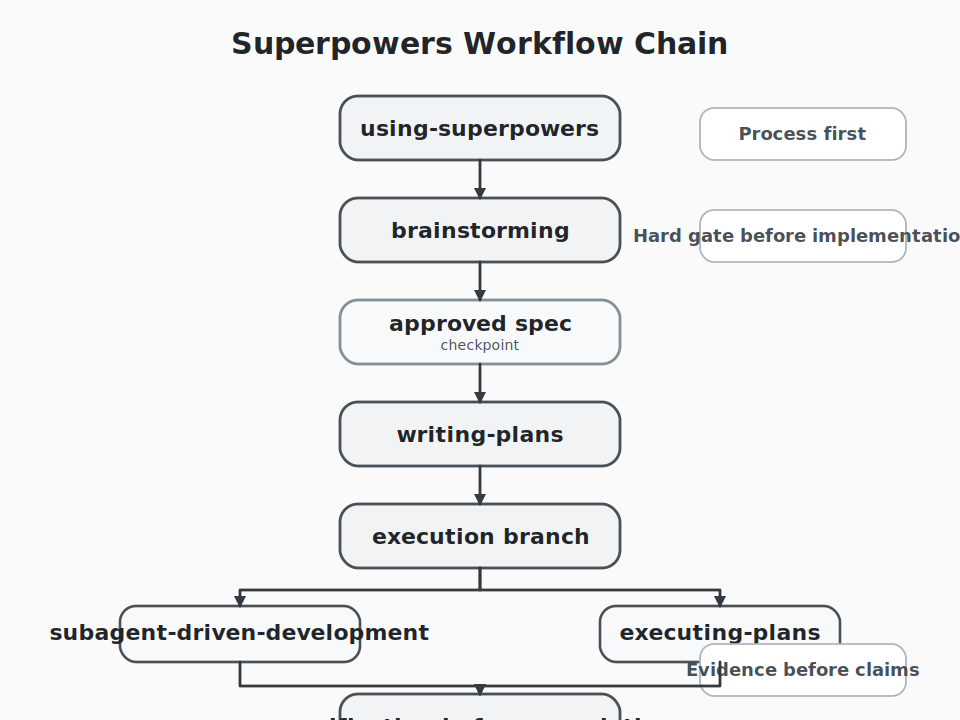

## Overview

Start with the chain itself:

```text
using-superpowers
  -> brainstorming
  -> spec
  -> writing-plans
  -> subagent-driven-development / executing-plans
  -> verification-before-completion
```



If `superpowers` is treated as a loose collection of callable skills, this chain looks heavy. But the current skill documents point to a different target. The problem is not that the model cannot write code. The problem is that, without workflow constraints, it tends to move into implementation too early.

In many AI coding sessions, the failure does not begin at the syntax level. It begins earlier: the requirements are still vague, the design is not fixed, the plan is not decomposed, and verification is not ready, but code generation has already started. The core move in `superpowers` is to turn those usually-skipped stages into hard gates, then connect those gates into a traceable workflow.

The rest of the article focuses on four questions: why the system constrains process before capability, why `brainstorming` is the hardest gate in the chain, how `writing-plans` turns a spec into executable work, and why multi-agent behavior here is not default parallelism but constrained collaboration.

## It Constrains Process Before It Extends Capability

The first rule in `using-superpowers` is direct: if there is even a 1% chance that a skill applies, the system must invoke the skill before acting. This requirement comes before clarification, before code inspection, and before the familiar impulse to “just try a quick change first.”

In practice, that matters because many coding mistakes come from a familiar habit: inspect a few files, make a small change, sketch a rough version, and clean up the process later. `using-superpowers` treats that habit itself as rationalization. It is not only against skipping a skill. It is against the broader pattern of implementing first and reconstructing process afterward.

That is also why it places process skills before implementation skills. The point is not to decide which skill is more powerful. The point is to decide how the work should be approached before deciding what concrete work to do. Without that first layer, `brainstorming`, `writing-plans`, review loops, and verification gates fall back into optional guidance instead of actual workflow control.

In that sense, `using-superpowers` is closer to an entry controller. It does not produce the design, code, or tests by itself. It defines which order counts as legitimate. For people used to having a model edit files immediately, this is often the least comfortable layer because it is the one that most directly constrains action.

## Why `brainstorming` Is the Main Gate in the System

If `using-superpowers` prevents no-process execution, `brainstorming` prevents implementation while the task is still vague. Its hard gate is stated very plainly in the current skill document: before a design has been presented and approved, the system must not invoke implementation skills, write code, scaffold a project, or take any implementation action, and that rule applies even when the task looks simple.

The important point here is not that design documents are inherently sacred. The point is that ambiguous work has to be compressed into something reviewable before implementation begins. To get there, `brainstorming` prescribes a very specific sequence:

1. inspect project context;
2. ask one question at a time;
3. propose two or three approaches with trade-offs;
4. present the design in sections and get approval;
5. write the spec;
6. run a spec review loop;
7. ask the user to review the spec;
8. only then transition to `writing-plans`.

Two parts of that flow are especially easy to underestimate. One is “one question at a time,” which limits the tendency to bundle unresolved uncertainty into a single pass. The other is the requirement to propose multiple approaches, which forces explicit comparison instead of letting the first idea stand in as the only reasonable one. In practice, both rules move disagreement and uncertainty forward into the design phase.

That is why `brainstorming` should not be read as a creativity layer. It is closer to requirement shaping. It turns a vague request into something that can be written into a spec, checked by reviewers, and decomposed by the next stage. Without that step, a detailed plan is still only a detailed expansion of unstable input.

## Skills Are Layered, Not Flat

If the system is read only as a list of skills, it is easy to mistake `superpowers` for a command catalog. But once the dependencies between the core skills are visible, it looks much more like a layered workflow.

The first layer is entry and process control, largely handled by `using-superpowers`. It does not solve the domain problem directly. It decides which workflow the task must enter.

The second layer is design and planning, built around `brainstorming` and `writing-plans`. The first turns an ambiguous request into an approved spec. The second turns that spec into a low-context, executable, verifiable task sequence.

The third layer is execution and verification, including `subagent-driven-development`, `executing-plans`, and `verification-before-completion`. At that point the system is no longer deciding what the work should be. It is deciding how to execute the agreed plan and how to prove completion before claiming it.

This structure has a practical consequence: the skills are not menu options with equal status. They are linked by precedence. `brainstorming` terminates in `writing-plans`. `writing-plans` then hands off to either `subagent-driven-development` or `executing-plans`. `verification-before-completion` acts as a terminal gate that blocks completion claims without fresh evidence.

From that angle, the point of `superpowers` is not how many skills it contains. The point is how each layer narrows the freedom of the next one. It is trying to reduce not what the model can do, but when it is allowed to do it.

## `writing-plans` Is the Bridge Between Spec and Execution

The output of `brainstorming` is not code. It is a spec. The skill that carries that spec into the execution layer is `writing-plans`.

Its requirements are unusually concrete. It does not ask for a vague project plan. It asks the writer to assume that the future implementer has almost no context for the repository or the domain, then spell out the files to touch, the responsibility of each task, the verification commands, the expected outputs, and even the task granularity step by step. The document keeps repeating the same priorities: exact file paths, exact commands, bite-sized tasks, and no abstract instructions such as “add validation.”

That makes `writing-plans` more than supporting documentation. It is the layer that compresses design intent into an executable interface. The spec answers what should be built and why. The plan answers which files change, in what order, and what evidence proves that each step is done.

This also explains why the earlier spec review loop matters. A plan assumes that the spec is stable enough to translate. If the spec is still drifting, `writing-plans` will produce a very detailed and very expensive decomposition of unstable assumptions.

After that, `writing-plans` does not execute the work itself. It routes execution into one of two branches. If the work fits the same-session, mostly-independent task model, it points toward `subagent-driven-development`. Otherwise it points toward `executing-plans`. In other words, `writing-plans` is not incidental. It is the bridge between design-time discipline and implementation-time discipline.

## Multi-Agent Behavior Here Is Constrained Collaboration, Not Default Parallelism

There is clear multi-agent design in `superpowers`, but it is not the same thing as “spawn more agents and go faster.” The current documents distinguish at least two different coordination modes.

The first is `dispatching-parallel-agents`. It is meant for problem domains that are actually independent, with no shared state and no hidden coupling. Its core assumption is not “there are many tasks.” Its assumption is “these tasks can be understood and solved without interfering with one another.” The skill document is equally clear about when not to use it, such as when failures are related, when full system state matters, or when multiple agents would collide.

The second is `subagent-driven-development`. It also uses multiple agents, but not through broad parallelism. Instead it builds a vertical loop around each task: implementer first, then spec reviewer, then code-quality reviewer, with the review order fixed. The document makes that order explicit: spec compliance must be checked before code quality.

That ordering matters because the system wants to answer two different questions in sequence. First: did the implementation match the approved spec? Second: is the implementation itself sound? If the first question is still open, early discussion of code elegance or structure can hide a more basic failure.

This is also why the skill emphasizes a fresh subagent per task. The implementer, the spec reviewer, and the quality reviewer each enter with different goals. The controller curates the context instead of letting every subagent inherit the entire session or wander through the repository on its own. The cost is more coordination work at the top level. The benefit is narrower task boundaries, cleaner role separation, and clearer review outcomes.

`executing-plans` plays a different role. It is the other execution branch. The current skill text explicitly says that if subagents are available, `subagent-driven-development` is usually the stronger fit. `executing-plans` is for carrying out the plan in a more direct execution session: review the plan critically first, then execute task by task, then move into the finishing flow after verification.

So the point of multi-agent execution in `superpowers` is not “more concurrency.” It is “when should work be parallel and isolated, when should it be serial and reviewed, and when should context be split across different roles.” The real optimization target is error propagation, not superficial throughput.

## A Typical Execution Path

Compressed into one path, the system works roughly like this: the user makes a request, `using-superpowers` decides which skill flow applies and blocks no-process action, `brainstorming` turns the request into an approved design and spec, `writing-plans` translates that spec into executable tasks, execution then follows either `subagent-driven-development` or `executing-plans` depending on task independence and environment, and `verification-before-completion` blocks any completion claim without fresh evidence.

The notable part of this chain is that each layer distrusts informal confidence from the previous one. Design has to become a spec. The spec has to be reviewed. The plan has to name exact files and commands. Completion cannot rely on intuition. A success claim requires fresh verification output. The process is slower, but the trade is clear: it replaces “I think this is done” with “I can show why this is done.”

## Costs, Boundaries, and Fit

This approach has obvious costs.

First, the startup is slower. For users who are used to asking a model to jump straight into code, the added stages of `brainstorming`, spec writing, planning, and review loops can feel heavy. Second, documentation and review have real overhead. On very small tasks, the process cost can approach or even exceed the implementation cost. Third, the system fits environments with strong subagent support better than environments without it.

But the trade is also concrete. It exposes requirement misunderstandings earlier. It pushes plan gaps into a stage where they are cheaper to fix. And it offers a stronger defense against false completion because `verification-before-completion` turns “no fresh evidence, no completion claim” into an explicit rule.

For that reason, `superpowers` should not be read as a universal speed plugin. It is better understood as a framework for engineering discipline. As task complexity, collaboration cost, and rework risk increase, the extra gates become easier to justify. When the task is tiny and already well bounded, the workflow cost becomes much more visible.

## A Safer Order for Understanding It

If the goal is to actually use this system, the safest order is not to start with multi-agent execution. It is to start with what the system refuses to let you do.

First, understand why `using-superpowers` insists on skill selection before action. That is the layer that decides whether process is allowed to outrank impulse.

Second, understand why `brainstorming` inserts clarification, option comparison, approval, spec writing, and review before implementation. It slows the start, but it also moves a large amount of rework into the design phase.

Third, look at how `writing-plans` turns the approved spec into exact tasks, and why the execution layer continues to split responsibilities across different roles and review gates.

Only after that does it make sense to add `dispatching-parallel-agents` or `subagent-driven-development`. Otherwise, multi-agent behavior is easy to misread as a more expensive version of “everyone starts coding at once,” when it is really a tightly constrained coordination model around context, roles, and verification order.

From the current skill documents, `superpowers` is not best described as a prompt collection. It is better described as a workflow system that breaks AI coding into controlled stages. The most important thing in it is not any single skill. It is the way those skills turn “design first, plan next, execute after that, verify at the end” into constraints that are not meant to be skipped.
